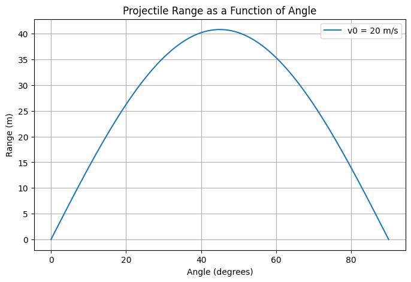
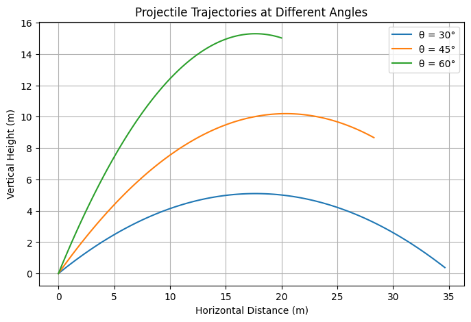

# Problem 1

# Investigating the Range as a Function of the Angle of Projection

## 1. Theoretical Background

Projectile motion is a fundamental topic in physics that explores how objects move under the influence of gravity. The horizontal range \(R\) of a projectile launched at an initial velocity \(v_0\) and an angle \(\theta\) is given by the equation:

$$
R = \frac{v_0^2 \sin(2\theta)}{g}
$$

where \(g\) is the acceleration due to gravity.

### Observations

- The range is maximized when \(\theta = 45^\circ\).
- Doubling the initial velocity quadruples the range.
- Increasing \(g\) decreases the range.

## 2. Analysis of the Range

The relationship between range and angle follows a sine function, producing a symmetric curve with a peak at \(45^\circ\). The range equation demonstrates that different initial velocities scale the curve proportionally while maintaining its shape.

### Effects of Parameters

- **Initial Velocity:** A higher \(v_0\) increases the range.
- **Gravitational Acceleration:** A larger \(g\) shortens the range.
- **Launch Height:** A non-zero launch height modifies the trajectory, requiring extended calculations.

## 3. Practical Applications

Projectile motion analysis is widely used in various fields:

- **Sports:** Determining optimal launch angles for kicking or throwing a ball.
- **Engineering:** Calculating ballistic trajectories for projectiles.
- **Astrophysics:** Studying object motion on planetary surfaces with varying gravity.
- **Military Applications:** Designing artillery systems and missile guidance.

## 4. Implementation

### Generated Plot

The relationship between projectile range and angle can be visualized in the following graph:

### Alternative Visualization

A second visualization shows projectile trajectories for different angles:

## 5. Discussion and Limitations

### Limitations

- **Air Resistance:** Neglecting drag overestimates the range.
- **Uneven Terrain:** Real-world landscapes can affect trajectory.
- **Wind Influence:** External forces alter the projectile's path.
- **Non-Uniform Gravity:** Different gravitational fields can modify results.

### Extensions

- Incorporating air resistance using numerical methods.
- Adapting the model for non-uniform gravitational fields.
- Simulating projectile motion on inclined surfaces.
- Using machine learning to predict optimal launch angles for different scenarios.

## Conclusion

This study explores the dependence of range on the angle of projection, providing insights applicable across multiple disciplines. Future extensions can enhance the realism of this model by incorporating additional physical factors such as air resistance and wind effects. The computational approach helps visualize and analyze projectile motion effectively, bridging theoretical physics with real-world applications.

