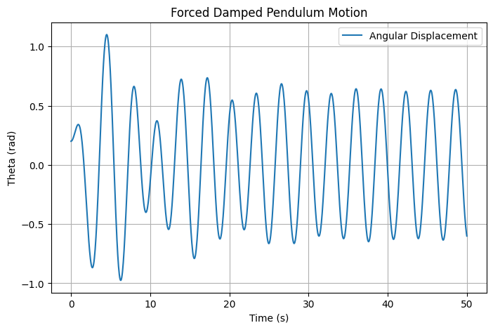
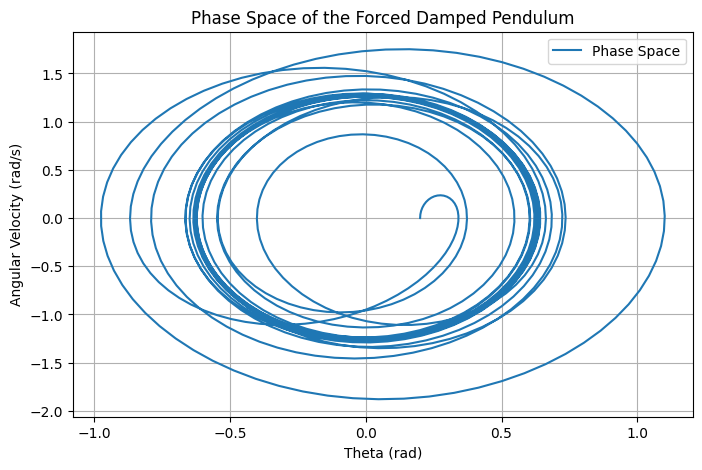

# Problem 2

# Investigating the Dynamics of a Forced Damped Pendulum

## 1. Introduction

The forced damped pendulum is a fundamental system in nonlinear dynamics, exhibiting a rich variety of behaviors, from simple harmonic motion to chaotic dynamics. The equation governing this system is given by:

$$
\frac{d^2\theta}{dt^2} + \gamma \frac{d\theta}{dt} + \omega_0^2 \sin\theta = A \cos(\omega t)
$$

where:

- \(\theta\) is the angular displacement,
- \(\gamma\) is the damping coefficient,
- \(\omega_0\) is the natural frequency,
- \(A\) is the amplitude of the external forcing,
- \(\omega\) is the driving frequency.

This system serves as a model for real-world phenomena, such as clock pendulums, electrical circuits, and even certain climate models.

## 2. Theoretical Analysis

### Energy Considerations

The total energy of the system consists of kinetic and potential energy:

$$
E = \frac{1}{2} I \left( \frac{d\theta}{dt} \right)^2 + mgL(1 - \cos\theta)
$$

where \(I\) is the moment of inertia, \(m\) is the mass, and \(L\) is the length of the pendulum. Damping leads to energy dissipation, and external forcing injects energy into the system, potentially leading to resonance or chaotic behavior.

### Stability and Bifurcations

- At low damping and small driving forces, the motion is periodic.
- As the driving force increases, period-doubling bifurcations can lead to chaos.
- Sensitive dependence on initial conditions characterizes chaotic behavior.

## 3. Numerical Simulation

We implement a numerical solver using Python to visualize the behavior of the forced damped pendulum.

### 3.1 Solving the Equation of Motion

```python
import numpy as np
import matplotlib.pyplot as plt
from scipy.integrate import solve_ivp

def pendulum_eq(t, y, gamma, omega0, A, omega):
    theta, omega_dot = y
    dydt = [omega_dot, -gamma * omega_dot - omega0**2 * np.sin(theta) + A * np.cos(omega * t)]
    return dydt

# Parameters
gamma = 0.2  # Damping coefficient
omega0 = 1.5  # Natural frequency
A = 1.2  # Forcing amplitude
omega = 2.0  # Driving frequency

# Initial conditions and time range
y0 = [0.2, 0.0]
t_span = (0, 50)
t_eval = np.linspace(*t_span, 1000)

sol = solve_ivp(pendulum_eq, t_span, y0, t_eval=t_eval, args=(gamma, omega0, A, omega))

# Plot results
plt.figure(figsize=(8, 5))
plt.plot(sol.t, sol.y[0], label='Angular Displacement')
plt.xlabel('Time (s)')
plt.ylabel('Theta (rad)')
plt.title('Forced Damped Pendulum Motion')
plt.legend()
plt.grid()
plt.savefig('forced_pendulum.png')
plt.show()
```

### Generated Plot



### 3.2 Phase Space Representation

To better understand the motion of the system, we visualize its phase space (angular displacement vs. angular velocity):

```python
plt.figure(figsize=(8, 5))
plt.plot(sol.y[0], sol.y[1], label='Phase Space')
plt.xlabel('Theta (rad)')
plt.ylabel('Angular Velocity (rad/s)')
plt.title('Phase Space of the Forced Damped Pendulum')
plt.legend()
plt.grid()
plt.savefig('phase_space.png')
plt.show()
```

### Phase Space Plot




## 5. Discussion and Applications

### Applications

- **Engineering:** Suspension systems, oscillators in mechanical devices.
- **Climatology:** Modeling atmospheric oscillations.
- **Quantum Mechanics:** Analogous systems in quantum chaos.
- **Biophysics:** Modeling biological rhythms and neural activity.

### Limitations and Extensions

- The model assumes a rigid pendulum with no flexibility.
- Air resistance is not explicitly included.
- The chaotic regime requires finer numerical resolution.
- External noise and real-world perturbations can alter the predicted behavior.
- Coupling multiple pendulums can reveal synchronization phenomena.

## Conclusion

The forced damped pendulum illustrates key concepts in nonlinear dynamics, offering insight into periodicity, resonance, and chaos. Future studies can extend the model to account for additional physical effects or explore synchronization phenomena in coupled oscillators. By using computational tools, we can gain a deeper understanding of the transitions between different motion regimes, which has profound implications for physics, engineering, and beyond.

