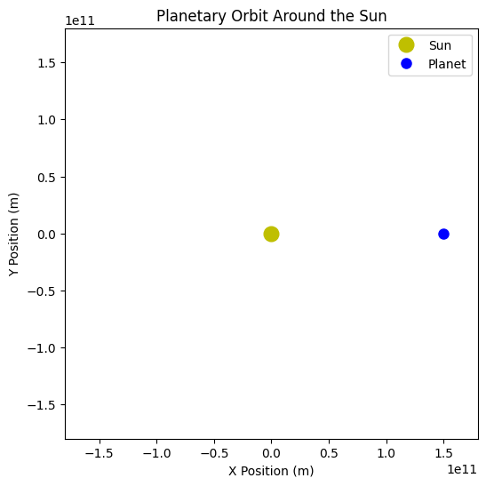
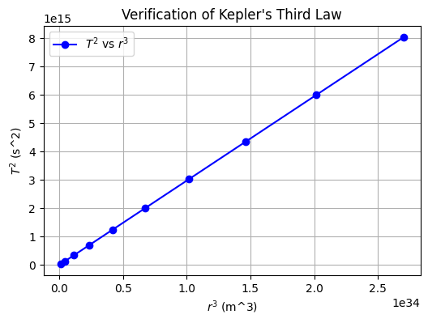

# Problem 1

# Orbital Period and Orbital Radius

## 1. Introduction

The relationship between the square of the orbital period and the cube of the orbital radius, known as **Kepler's Third Law**, is a fundamental principle in celestial mechanics. This law describes how planetary bodies orbit a central mass and helps in calculating planetary distances, satellite dynamics, and even exoplanet detection.

Kepler's Third Law is mathematically expressed as:

$$
T^2 = \frac{4\pi^2 r^3}{GM}
$$

where:

- \(T\) is the orbital period,
- \(r\) is the orbital radius,
- \(G\) is the gravitational constant,
- \(M\) is the mass of the central body.

This law applies to celestial bodies in stable circular orbits and provides key insights into planetary systems.

## 2. Theoretical Derivation

Using Newton’s Law of Universal Gravitation and the concept of centripetal force, we derive Kepler’s Third Law.

1. **Gravitational Force**:
   $$
   F_g = \frac{GMm}{r^2}
   $$
2. **Centripetal Force**:
   $$
   F_c = \frac{m v^2}{r}
   $$
3. Equating these forces and solving for \(T\), we obtain Kepler’s Third Law.

## 3. Computational Verification

To verify Kepler’s Third Law computationally, we simulate a planetary orbit and analyze the relationship between \(T^2\) and \(r^3\).

### 3.1 Simulating Orbital Motion

<!-- ```python
import numpy as np
import matplotlib.pyplot as plt
import matplotlib.animation as animation

# Constants
G = 6.67430e-11  # Gravitational constant (m^3 kg^-1 s^-2)
M_sun = 1.989e30  # Mass of the Sun (kg)
r = 1.5e11  # 1 AU in meters

# Orbital Period Calculation
T = np.sqrt((4 * np.pi**2 * r**3) / (G * M_sun))
omega = 2 * np.pi / T  # Angular velocity

time_steps = 500

t = np.linspace(0, T, time_steps)
x = r * np.cos(omega * t)
y = r * np.sin(omega * t)

fig, ax = plt.subplots(figsize=(6,6))
ax.set_xlim(-1.2*r, 1.2*r)
ax.set_ylim(-1.2*r, 1.2*r)
ax.set_xlabel("X Position (m)")
ax.set_ylabel("Y Position (m)")
ax.set_title("Planetary Orbit Around the Sun")
ax.plot(0, 0, 'yo', markersize=12, label="Sun")
planet, = ax.plot([], [], 'bo', markersize=8, label="Planet")

def animate(i):
    planet.set_data([x[i]], [y[i]])
    return planet,

ani = animation.FuncAnimation(fig, animate, frames=len(t), interval=20, blit=True)
plt.legend()
plt.show()
``` -->




#### 3.2 Graphical Analysis of Kepler’s Third Law

Now, let's numerically verify Kepler’s Third Law by simulating different orbital radii and comparing \( T^2 \) vs. \( r^3 \).

<!-- ```python
# Simulating multiple orbital radii and periods
radii = np.linspace(0.5e11, 3e11, 10)  # Varying radii from 0.5 AU to 3 AU
periods = np.sqrt((4 * np.pi**2 * radii**3) / (G * M_sun))

# Plotting T^2 vs r^3
plt.figure(figsize=(6,4))
plt.plot(radii**3, periods**2, 'bo-', label='$T^2$ vs $r^3$')
plt.xlabel('$r^3$ (m^3)')
plt.ylabel('$T^2$ (s^2)')
plt.title("Verification of Kepler's Third Law")
plt.legend()
plt.grid()
plt.show()
``` -->

Below is the graphical verification of Kepler’s Third Law:



## 4. Discussion and Applications

### 4.1 Implications in Astronomy

- Used to estimate planetary masses and distances.
- Helps in predicting satellite orbits around Earth.
- Supports exoplanet detection by analyzing orbital periods.

### 4.2 Extending to Elliptical Orbits

Kepler’s Third Law also applies to elliptical orbits by replacing \(r\) with the **semi-major axis** \(a\):

$$
T^2 = \frac{4\pi^2 a^3}{GM}
$$

This allows astronomers to calculate orbits for non-circular paths, common in planetary motion.

### 4.3 Real-World Examples

- The Moon’s orbit around Earth follows Kepler’s Law with high precision.
- GPS satellites rely on these principles to maintain stable orbits.
- Space agencies use Kepler’s Law for mission planning, such as Mars rover landings.

## 5. Conclusion

Kepler’s Third Law provides a foundational understanding of orbital mechanics, bridging theoretical physics with real-world applications. By numerically simulating orbits and verifying the law’s predictions, we can deepen our comprehension of celestial dynamics and planetary systems.

