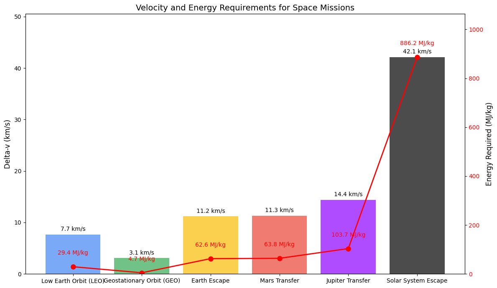

# Problem 2

# Escape Velocities and Cosmic Velocities

## 1. Introduction

Escape velocity and cosmic velocities are fundamental concepts in astrodynamics that determine the requirements for objects to achieve various orbital states or escape gravitational fields entirely. These velocities establish the energy thresholds necessary for space exploration missions, from placing satellites in orbit to interplanetary travel and beyond.

The escape velocity from a celestial body is mathematically expressed as:

$$
v_e = \sqrt{\frac{2GM}{r}}
$$

where:

- \(v_e\) is the escape velocity,
- \(G\) is the gravitational constant,
- \(M\) is the mass of the celestial body,
- \(r\) is the distance from the center of the celestial body.

This equation represents the minimum velocity required for an object to completely escape the gravitational influence of a celestial body, assuming no additional forces are present.

## 2. Cosmic Velocities: Definitions and Physical Meaning

### 2.1 First Cosmic Velocity (Orbital Velocity)

The first cosmic velocity, also known as the circular orbital velocity, is the speed required for an object to maintain a stable circular orbit around a celestial body at a given altitude. It is defined as:

$$
v_1 = \sqrt{\frac{GM}{r}}
$$

This velocity allows satellites and space stations to remain in orbit without falling back to Earth or escaping into space.

### 2.2 Second Cosmic Velocity (Escape Velocity)

The second cosmic velocity is identical to the escape velocity defined earlier. It represents the minimum speed needed for an object to completely escape the gravitational field of a celestial body:

$$
v_2 = \sqrt{\frac{2GM}{r}} = \sqrt{2} \cdot v_1
$$

Note that the escape velocity is exactly \(\sqrt{2}\) times the orbital velocity at the same distance.

### 2.3 Third Cosmic Velocity (Solar System Escape Velocity)

The third cosmic velocity is the speed required for an object to escape not just the gravitational pull of its parent planet, but the entire solar system:

$$
v_3 = \sqrt{v_2^2 + v_{sun}^2}
$$

where \(v_{sun}\) is the escape velocity from the Sun at the planet's orbital distance. For Earth, this is approximately 42.1 km/s.

## 3. Mathematical Derivation

### 3.1 Derivation of Escape Velocity

To derive the escape velocity, we use the principle of energy conservation. For an object to escape a gravitational field:

1. **Initial Energy**: The sum of kinetic and potential energy at the surface
   $$
   E_i = \frac{1}{2}mv_e^2 - \frac{GMm}{r}
   $$

2. **Final Energy**: The energy at infinite distance (potential energy approaches zero)
   $$
   E_f = 0
   $$

3. **Energy Conservation**: Setting \(E_i = E_f\) and solving for \(v_e\):
   $$
   \frac{1}{2}mv_e^2 - \frac{GMm}{r} = 0
   $$
   $$
   v_e = \sqrt{\frac{2GM}{r}}
   $$

### 3.2 Derivation of Orbital Velocity

For circular orbit, the centripetal force must equal the gravitational force:

$$
\frac{mv_1^2}{r} = \frac{GMm}{r^2}
$$

Solving for \(v_1\):

$$
v_1 = \sqrt{\frac{GM}{r}}
$$

## 4. Computational Analysis

### 4.1 Calculating Cosmic Velocities for Different Celestial Bodies

```python
import numpy as np
import matplotlib.pyplot as plt
import pandas as pd
from matplotlib.ticker import ScalarFormatter

# Constants
G = 6.67430e-11  # Gravitational constant (m^3 kg^-1 s^-2)

# Celestial body data
bodies = {
    'Earth': {'mass': 5.972e24, 'radius': 6.371e6, 'color': 'blue'},
    'Mars': {'mass': 6.417e23, 'radius': 3.390e6, 'color': 'red'},
    'Jupiter': {'mass': 1.898e27, 'radius': 6.991e7, 'color': 'orange'},
    'Moon': {'mass': 7.342e22, 'radius': 1.737e6, 'color': 'gray'},
    'Venus': {'mass': 4.867e24, 'radius': 6.052e6, 'color': 'gold'}
}

# Sun data for third cosmic velocity
sun_mass = 1.989e30
earth_orbital_radius = 1.496e11  # Earth's distance from Sun (m)
mars_orbital_radius = 2.279e11   # Mars's distance from Sun (m)
jupiter_orbital_radius = 7.785e11  # Jupiter's distance from Sun (m)
venus_orbital_radius = 1.082e11  # Venus's distance from Sun (m)

orbital_radii = {
    'Earth': earth_orbital_radius,
    'Mars': mars_orbital_radius,
    'Jupiter': jupiter_orbital_radius,
    'Venus': venus_orbital_radius,
    'Moon': earth_orbital_radius  # Moon orbits with Earth around the Sun
}

# Calculate cosmic velocities
results = []

for body, data in bodies.items():
    # First cosmic velocity (orbital velocity) at surface
    v1 = np.sqrt(G * data['mass'] / data['radius'])
    
    # Second cosmic velocity (escape velocity) at surface
    v2 = np.sqrt(2 * G * data['mass'] / data['radius'])
    
    # Sun's escape velocity at the body's orbital distance
    v_sun_escape = np.sqrt(2 * G * sun_mass / orbital_radii[body])
    
    # Third cosmic velocity (solar system escape)
    v3 = np.sqrt(v2**2 + v_sun_escape**2)
    
    results.append({
        'Body': body,
        'First Cosmic Velocity (km/s)': v1 / 1000,
        'Second Cosmic Velocity (km/s)': v2 / 1000,
        'Third Cosmic Velocity (km/s)': v3 / 1000
    })

# Create DataFrame for display
df = pd.DataFrame(results)
print(df)

# Plotting
plt.figure(figsize=(12, 8))
bar_width = 0.25
index = np.arange(len(bodies))

plt.bar(index, df['First Cosmic Velocity (km/s)'], bar_width, 
        label='First Cosmic Velocity', color=[bodies[body]['color'] for body in df['Body']], alpha=0.7)
plt.bar(index + bar_width, df['Second Cosmic Velocity (km/s)'], bar_width,
        label='Second Cosmic Velocity', color=[bodies[body]['color'] for body in df['Body']], alpha=0.9)
plt.bar(index + 2*bar_width, df['Third Cosmic Velocity (km/s)'], bar_width,
        label='Third Cosmic Velocity', color=[bodies[body]['color'] for body in df['Body']])

plt.xlabel('Celestial Body')
plt.ylabel('Velocity (km/s)')
plt.title('Cosmic Velocities for Different Celestial Bodies')
plt.xticks(index + bar_width, df['Body'])
plt.legend()
plt.grid(axis='y', linestyle='--', alpha=0.7)

# Use log scale for better visualization
plt.yscale('log')
plt.gca().yaxis.set_major_formatter(ScalarFormatter())

plt.tight_layout()
plt.savefig('cosmic_velocities.png', dpi=300)
plt.show()
```


### 4.2 Escape Velocity as a Function of Distance

```python
import numpy as np
import matplotlib.pyplot as plt

# Constants
G = 6.67430e-11  # Gravitational constant (m^3 kg^-1 s^-2)

# Celestial body data
bodies = {
    'Earth': {'mass': 5.972e24, 'radius': 6.371e6, 'color': 'blue'},
    'Mars': {'mass': 6.417e23, 'radius': 3.390e6, 'color': 'red'},
    'Jupiter': {'mass': 1.898e27, 'radius': 6.991e7, 'color': 'orange'}
}

# Distance range (multiples of radius)
radius_multiples = np.linspace(1, 10, 100)

plt.figure(figsize=(10, 6))

for body, data in bodies.items():
    # Calculate distances
    distances = radius_multiples * data['radius']
    
    # Calculate escape velocities at each distance
    escape_velocities = np.sqrt(2 * G * data['mass'] / distances) / 1000  # Convert to km/s
    
    # Plot
    plt.plot(radius_multiples, escape_velocities, label=body, color=data['color'], linewidth=2)
    
    # Mark the surface escape velocity
    surface_escape = np.sqrt(2 * G * data['mass'] / data['radius']) / 1000
    plt.scatter([1], [surface_escape], color=data['color'], s=50, zorder=5)
    plt.annotate(f"{surface_escape:.1f} km/s", 
                 xy=(1.05, surface_escape), 
                 color=data['color'],
                 fontweight='bold')

plt.xlabel('Distance (multiples of planetary radius)')
plt.ylabel('Escape Velocity (km/s)')
plt.title('Escape Velocity vs. Distance from Celestial Body Center')
plt.grid(True, linestyle='--', alpha=0.7)
plt.legend()
plt.tight_layout()
plt.savefig('escape_velocity_distance.png', dpi=300)
plt.show()
```


### 4.3 Energy Requirements for Different Mission Types

```python
import numpy as np
import matplotlib.pyplot as plt

# Constants
G = 6.67430e-11  # Gravitational constant (m^3 kg^-1 s^-2)
earth_mass = 5.972e24  # kg
earth_radius = 6.371e6  # m

# Mission types and their velocity requirements
mission_types = [
    "Low Earth Orbit (LEO)",
    "Geostationary Orbit (GEO)",
    "Earth Escape",
    "Mars Transfer",
    "Jupiter Transfer",
    "Solar System Escape"
]

# Approximate delta-v requirements (km/s)
delta_v = [
    np.sqrt(G * earth_mass / (earth_radius + 400e3)) / 1000,  # LEO (400 km altitude)
    np.sqrt(G * earth_mass / (earth_radius + 35786e3)) / 1000,  # GEO
    np.sqrt(2 * G * earth_mass / earth_radius) / 1000,  # Earth Escape
    11.3,  # Mars Transfer (Hohmann)
    14.4,  # Jupiter Transfer (Hohmann)
    42.1   # Solar System Escape
]

# Energy per kg (MJ/kg) = 0.5 * v^2 (v in m/s)
energy_per_kg = [0.5 * (v * 1000)**2 / 1e6 for v in delta_v]

# Create the plot
fig, ax1 = plt.subplots(figsize=(12, 7))

# Bar colors
colors = ['#4285F4', '#34A853', '#FBBC05', '#EA4335', '#8F00FF', '#000000']

# Plot delta-v bars
bars = ax1.bar(mission_types, delta_v, color=colors, alpha=0.7)
ax1.set_ylabel('Delta-v (km/s)', fontsize=12)
ax1.set_title('Velocity and Energy Requirements for Space Missions', fontsize=14)
ax1.tick_params(axis='y')
ax1.set_ylim(0, max(delta_v) * 1.2)

# Add a second y-axis for energy
ax2 = ax1.twinx()
ax2.set_ylabel('Energy Required (MJ/kg)', fontsize=12)
ax2.plot(mission_types, energy_per_kg, 'ro-', linewidth=2, markersize=8)
ax2.tick_params(axis='y', labelcolor='r')
ax2.set_ylim(0, max(energy_per_kg) * 1.2)

# Add value labels on bars
for i, bar in enumerate(bars):
    height = bar.get_height()
    ax1.text(bar.get_x() + bar.get_width()/2., height + 0.5,
             f'{delta_v[i]:.1f} km/s',
             ha='center', va='bottom', fontsize=10)
    
    # Add energy labels
    ax2.text(i, energy_per_kg[i] + max(energy_per_kg) * 0.05,
             f'{energy_per_kg[i]:.1f} MJ/kg',
             ha='center', va='bottom', color='red', fontsize=10)

plt.xticks(rotation=45, ha='right')
plt.tight_layout()
plt.savefig('mission_requirements.png', dpi=300)
plt.show()
```



## 5. Applications in Space Exploration

### 5.1 Satellite Deployment

The first cosmic velocity is crucial for satellite deployment. Different orbital altitudes require specific velocities:

- Low Earth Orbit (LEO): 7.8 km/s
- Medium Earth Orbit (MEO): 6.9 km/s
- Geostationary Orbit (GEO): 3.1 km/s

Satellites must achieve these precise velocities to maintain stable orbits. Too slow, and they fall back to Earth; too fast, and they escape into higher orbits or leave Earth's influence entirely.

### 5.2 Interplanetary Missions

For missions to other planets, spacecraft must achieve at least the second cosmic velocity to escape Earth's gravity. However, efficient interplanetary transfers use the Hohmann transfer orbit, which requires:

1. Escaping Earth's gravity well
2. Entering a heliocentric transfer orbit
3. Capturing into the target planet's orbit

The total delta-v (change in velocity) required for Mars missions is approximately 11-12 km/s, while Jupiter missions require 14-15 km/s.

### 5.3 Gravity Assists and the Oberth Effect

To reduce the enormous energy requirements for distant missions, spacecraft often use:

- **Gravity assists**: Using a planet's gravity to gain velocity without expending fuel
- **The Oberth effect**: Performing burns at periapsis (closest approach) to maximize efficiency

These techniques have enabled missions like Voyager, New Horizons, and Juno to reach the outer planets and beyond despite limited fuel capacity.

### 5.4 Interstellar Travel Considerations

For theoretical interstellar missions, spacecraft would need to achieve the third cosmic velocity (42.1 km/s from Earth) to escape the Solar System. However, practical interstellar travel would require much higher velocities to reach other star systems within reasonable timeframes:

- Alpha Centauri (closest star system): Would take ~70,000 years at current spacecraft speeds
- Achieving 10% of light speed would reduce this to ~43 years

The enormous energy requirements for such missions remain a significant technological challenge.

## 6. Practical Implications

### 6.1 Launch Vehicle Design

Rocket design is fundamentally driven by the need to achieve these cosmic velocities. The Tsiolkovsky rocket equation relates the change in velocity (delta-v) to the exhaust velocity and mass ratio:

$$
\Delta v = v_e \ln\left(\frac{m_0}{m_f}\right)
$$

where:
- \(\Delta v\) is the change in velocity
- \(v_e\) is the exhaust velocity
- \(m_0\) is the initial mass
- \(m_f\) is the final mass

This equation highlights why achieving escape velocity requires multi-stage rockets with high mass ratios.

### 6.2 Fuel Efficiency and Propulsion Technologies

Different propulsion technologies offer varying levels of efficiency for achieving cosmic velocities:

- Chemical rockets: Limited by exhaust velocities (~4.5 km/s)
- Ion propulsion: Higher exhaust velocities (~30 km/s) but low thrust
- Nuclear thermal: Potential for higher performance than chemical rockets
- Advanced concepts (nuclear pulse, fusion): Theoretical capability for interstellar missions

### 6.3 Space Mission Planning

Mission planners must carefully calculate launch windows based on:
- Required cosmic velocities
- Planetary alignments
- Available delta-v budget
- Gravity assist opportunities

These calculations determine mission feasibility, duration, and cost.

## 7. Conclusion

The concepts of escape velocity and cosmic velocities establish the fundamental energy thresholds for space exploration. From placing satellites in Earth orbit to sending probes beyond our solar system, these velocities define what is physically possible and economically feasible in space travel.

As propulsion technology advances, missions that were once impossible may become routine, potentially opening new frontiers in space exploration. Understanding these velocity thresholds is essential for planning future missions and developing the next generation of spacecraft.

The computational analysis presented here demonstrates how these velocities vary across different celestial bodies and distances, providing a framework for evaluating mission requirements and capabilities. By leveraging these principles, space agencies can continue to push the boundaries of human exploration beyond Earth and throughout our solar system.