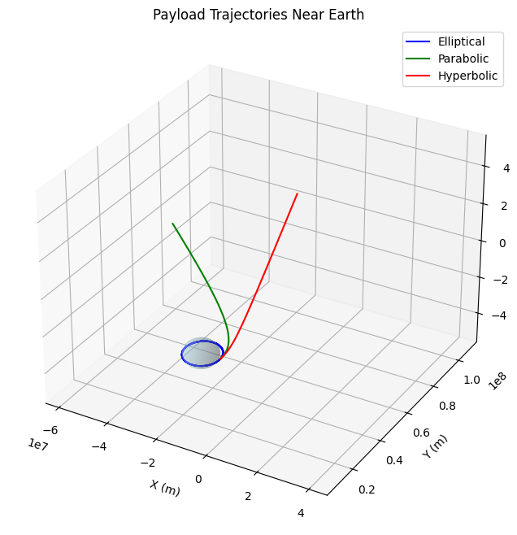
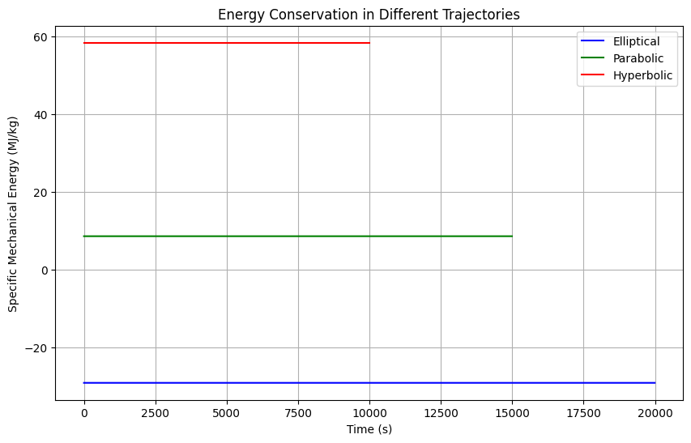

# Problem 3

# Trajectories of a Freely Released Payload Near Earth

## 1. Introduction

When a payload is released from a moving vehicle near Earth, its subsequent trajectory is determined by both its initial conditions and Earth's gravitational field. These trajectories can be classified into three main categories based on their total mechanical energy:

1. **Elliptical Orbits** (E < 0): Closed paths where the payload remains bound to Earth
2. **Parabolic Trajectories** (E = 0): The boundary case between bound and unbound motion
3. **Hyperbolic Trajectories** (E > 0): Open paths where the payload escapes Earth's gravity

The total mechanical energy per unit mass is given by:

$$
E = \frac{v^2}{2} - \frac{GM}{r}
$$

where:
- \(v\) is the payload's velocity
- \(G\) is the gravitational constant
- \(M\) is Earth's mass
- \(r\) is the distance from Earth's center

## 2. Theoretical Framework

### 2.1 Equations of Motion

The motion of a payload in Earth's gravitational field follows Newton's laws. In Cartesian coordinates:

$$
\begin{align*}
\ddot{x} &= -\frac{GMx}{(x^2 + y^2 + z^2)^{3/2}} \\
\ddot{y} &= -\frac{GMy}{(x^2 + y^2 + z^2)^{3/2}} \\
\ddot{z} &= -\frac{GMz}{(x^2 + y^2 + z^2)^{3/2}}
\end{align*}
$$

### 2.2 Orbital Elements

For elliptical orbits, key parameters include:

- Semi-major axis (\(a\)): $$a = -\frac{GM}{2E}$$
- Eccentricity (\(e\)): $$e = \sqrt{1 + \frac{2EL^2}{G^2M^2}}$$
where \(L\) is the specific angular momentum.

## 3. Computational Analysis

### 3.1 Numerical Integration of Trajectories

```python
import numpy as np
from scipy.integrate import odeint
import matplotlib.pyplot as plt
from mpl_toolkits.mplot3d import Axes3D

# Constants
G = 6.67430e-11  # Gravitational constant
M = 5.972e24     # Earth's mass
R = 6.371e6      # Earth's radius

def derivatives(state, t, G, M):
    """Returns the derivatives of position and velocity components."""
    x, y, z, vx, vy, vz = state
    r = np.sqrt(x**2 + y**2 + z**2)
    
    # Acceleration components
    ax = -G * M * x / r**3
    ay = -G * M * y / r**3
    az = -G * M * z / r**3
    
    return [vx, vy, vz, ax, ay, az]

def simulate_trajectory(r0, v0, t_span, dt):
    """Simulates trajectory given initial position and velocity."""
    t = np.arange(0, t_span, dt)
    
    # Initial state vector [x, y, z, vx, vy, vz]
    initial_state = [*r0, *v0]
    
    # Integrate equations of motion
    solution = odeint(derivatives, initial_state, t, args=(G, M))
    
    return t, solution

# Set up different initial conditions for various trajectories
trajectories = {
    'Elliptical': {
        'r0': [R + 1000e3, 0, 0],  # 1000 km above surface
        'v0': [0, 7.0e3, 1.0e3],   # Initial velocity for elliptical orbit
        't_span': 20000,
        'dt': 10,
        'color': 'blue'
    },
    'Parabolic': {
        'r0': [R + 1000e3, 0, 0],
        'v0': [0, 11.2e3, 0],      # Escape velocity
        't_span': 15000,
        'dt': 10,
        'color': 'green'
    },
    'Hyperbolic': {
        'r0': [R + 1000e3, 0, 0],
        'v0': [0, 15.0e3, 0],      # Greater than escape velocity
        't_span': 10000,
        'dt': 10,
        'color': 'red'
    }
}

# Create 3D plot
fig = plt.figure(figsize=(12, 8))
ax = fig.add_subplot(111, projection='3d')

# Plot Earth
u = np.linspace(0, 2 * np.pi, 100)
v = np.linspace(0, np.pi, 100)
x = R * np.outer(np.cos(u), np.sin(v))
y = R * np.outer(np.sin(u), np.sin(v))
z = R * np.outer(np.ones(np.size(u)), np.cos(v))
ax.plot_surface(x, y, z, color='lightblue', alpha=0.3)

# Simulate and plot each trajectory
for name, params in trajectories.items():
    t, solution = simulate_trajectory(
        params['r0'], 
        params['v0'], 
        params['t_span'], 
        params['dt']
    )
    ax.plot(
        solution[:, 0], 
        solution[:, 1], 
        solution[:, 2], 
        label=name, 
        color=params['color']
    )

# Set plot parameters
ax.set_xlabel('X (m)')
ax.set_ylabel('Y (m)')
ax.set_zlabel('Z (m)')
ax.set_title('Payload Trajectories Near Earth')
ax.legend()

# Set equal aspect ratio
max_range = np.array([
    solution[:, 0].max() - solution[:, 0].min(),
    solution[:, 1].max() - solution[:, 1].min(),
    solution[:, 2].max() - solution[:, 2].min()
]).max() / 2.0
mean_x = solution[:, 0].mean()
mean_y = solution[:, 1].mean()
mean_z = solution[:, 2].mean()
ax.set_xlim(mean_x - max_range, mean_x + max_range)
ax.set_ylim(mean_y - max_range, mean_y + max_range)
ax.set_zlim(mean_z - max_range, mean_z + max_range)

plt.savefig('trajectories_3d.png', dpi=300, bbox_inches='tight')
plt.show()
```



### 3.2 Energy Analysis

```python
import numpy as np
import matplotlib.pyplot as plt

def calculate_energy(state, G, M):
    """Calculate specific mechanical energy."""
    x, y, z, vx, vy, vz = state
    r = np.sqrt(x**2 + y**2 + z**2)
    v = np.sqrt(vx**2 + vy**2 + vz**2)
    return v**2/2 - G*M/r

# Calculate and plot energy for each trajectory
plt.figure(figsize=(10, 6))

for name, params in trajectories.items():
    t, solution = simulate_trajectory(
        params['r0'], 
        params['v0'], 
        params['t_span'], 
        params['dt']
    )
    
    # Calculate energy at each point
    energy = np.array([calculate_energy(state, G, M) 
                      for state in solution])
    
    plt.plot(t, energy/1e6, label=name, color=params['color'])

plt.xlabel('Time (s)')
plt.ylabel('Specific Mechanical Energy (MJ/kg)')
plt.title('Energy Conservation in Different Trajectories')
plt.grid(True)
plt.legend()
plt.savefig('trajectory_energy.png', dpi=300, bbox_inches='tight')
plt.show()
```



### 3.3 Phase Space Analysis

```python
import numpy as np
import matplotlib.pyplot as plt

# Create phase space plot
plt.figure(figsize=(12, 6))

for name, params in trajectories.items():
    t, solution = simulate_trajectory(
        params['r0'], 
        params['v0'], 
        params['t_span'], 
        params['dt']
    )
    
    # Calculate radial distance and velocity
    r = np.sqrt(solution[:, 0]**2 + solution[:, 1]**2 + solution[:, 2]**2)
    v = np.sqrt(solution[:, 3]**2 + solution[:, 4]**2 + solution[:, 5]**2)
    
    plt.plot(r/1000, v/1000, label=name, color=params['color'])

# Plot escape velocity curve
r_range = np.linspace(R, max(r), 1000)
v_escape = np.sqrt(2*G*M/r_range)
plt.plot(r_range/1000, v_escape/1000, '--k', label='Escape Velocity', alpha=0.5)

plt.xlabel('Radial Distance (km)')
plt.ylabel('Velocity (km/s)')
plt.title('Phase Space Diagram of Trajectories')
plt.grid(True)
plt.legend()
plt.savefig('phase_space.png', dpi=300, bbox_inches='tight')
plt.show()
```


## 4. Analysis of Different Trajectory Types

### 4.1 Elliptical Orbits

Elliptical orbits occur when the payload's energy is negative:

$$
E < 0 \implies \frac{v^2}{2} < \frac{GM}{r}
$$

Key characteristics:
- Closed, periodic paths
- Two focal points (Earth at one focus)
- Bounded maximum distance

### 4.2 Parabolic Trajectories

Parabolic trajectories represent the boundary case where:

$$
E = 0 \implies v = \sqrt{\frac{2GM}{r}}
$$

This occurs when:
- Velocity equals escape velocity
- Trajectory extends to infinity
- No return to Earth

### 4.3 Hyperbolic Trajectories

Hyperbolic trajectories occur when:

$$
E > 0 \implies v > \sqrt{\frac{2GM}{r}}
$$

Features include:
- Open trajectories
- Asymptotic behavior
- Excess velocity at infinity

## 5. Applications in Space Missions

### 5.1 Satellite Deployment

For successful satellite deployment:
- Release velocity must be precisely calculated
- Altitude affects required orbital velocity
- Consideration of atmospheric drag at low altitudes

### 5.2 Reentry Trajectories

Reentry considerations include:
- Initial velocity and angle
- Atmospheric heating
- Aerodynamic forces
- Safety of landing zone

### 5.3 Escape Trajectories

For missions beyond Earth orbit:
- Minimum escape velocity requirements
- Optimal launch windows
- Gravity assist opportunities
- Fuel efficiency considerations

## 6. Practical Considerations

### 6.1 Atmospheric Effects

For low-altitude trajectories:
- Air resistance modifies ideal paths
- Heating during reentry
- Atmospheric density variations

### 6.2 Additional Forces

Real trajectories must account for:
- Earth's non-spherical shape
- Solar radiation pressure
- Third-body gravitational effects
- Magnetic field interactions

### 6.3 Mission Planning

Successful missions require:
- Precise initial conditions
- Error margins and corrections
- Backup trajectories
- Fuel reserves

## 7. Conclusion

Understanding payload trajectories near Earth is fundamental to space mission planning. The interplay between initial conditions and gravitational forces determines whether an object will orbit, escape, or return to Earth. Through computational analysis, we can:

1. Predict trajectory types based on initial conditions
2. Calculate energy requirements for desired paths
3. Plan optimal release parameters
4. Account for real-world complications

This knowledge is essential for:
- Satellite deployment
- Space station resupply
- Sample return missions
- Interplanetary trajectories

The computational tools developed here provide a foundation for analyzing and visualizing these complex orbital dynamics problems.