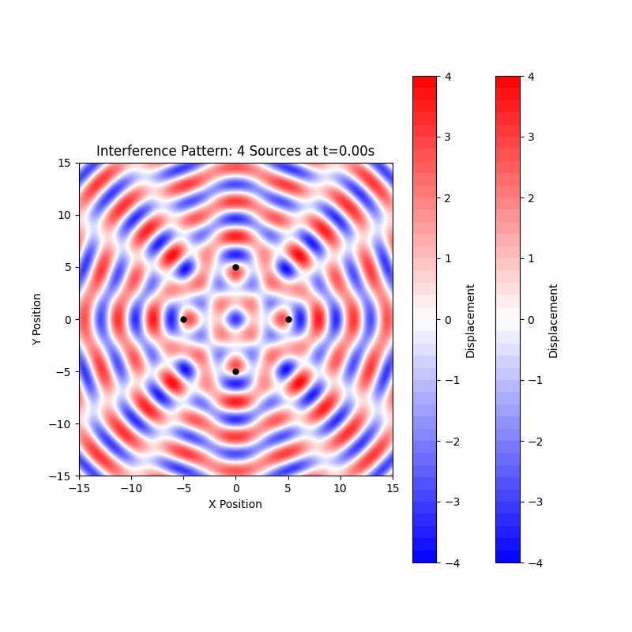

# Problem 1

# Interference Patterns on a Water Surface

## 1. Introduction

When multiple waves propagate through the same medium, they combine according to the principle of superposition, creating interference patterns. These patterns reveal fundamental properties of wave behavior and have applications across many fields of physics, from optics to quantum mechanics. Water waves provide an excellent medium for visualizing these interference phenomena.

For a single point source, a circular wave on a water surface can be described by:

$$
D_i(r_i, t) = A \cos(kr_i - \omega t + \phi_i)
$$

where:
- $D_i$ is the displacement at point $(x,y)$ due to source $i$
- $A$ is the amplitude
- $k = 2\pi/\lambda$ is the wave number (where $\lambda$ is wavelength)
- $\omega = 2\pi f$ is the angular frequency (where $f$ is frequency)
- $r_i$ is the distance from source $i$ to point $(x,y)$
- $\phi_i$ is the initial phase of source $i$

When multiple sources generate waves simultaneously, the total displacement at any point is the sum of the individual displacements:

$$
D_{total}(x,y,t) = \sum_{i=1}^{n} D_i(r_i, t)
$$

## 2. Theoretical Framework

### 2.1 Interference Conditions

Interference patterns result from the phase relationships between overlapping waves:

- **Constructive Interference**: Occurs when waves are in phase, resulting in amplified displacement.
  
  Condition: $\Delta\phi = 2\pi n$ where $n$ is an integer
  
- **Destructive Interference**: Occurs when waves are out of phase, resulting in diminished displacement.
  
  Condition: $\Delta\phi = (2n+1)\pi$ where $n$ is an integer

The phase difference $\Delta\phi$ between waves from two sources depends on:
1. Path length difference: $\Delta r = |r_1 - r_2|$
2. Initial phase difference: $\Delta\phi_0 = |\phi_1 - \phi_2|$

The total phase difference is: $\Delta\phi = k\Delta r + \Delta\phi_0$

### 2.2 Geometric Interpretation

For sources arranged in a regular polygon, the interference pattern exhibits symmetry related to the polygon's geometry. The patterns can be analyzed using:

- **Nodal Lines**: Curves where destructive interference produces zero displacement
- **Antinodal Lines**: Curves where constructive interference produces maximum displacement

## 3. Computational Analysis

We'll examine the interference patterns created by sources positioned at the vertices of regular polygons. For this analysis, we'll consider three configurations:
1. Triangular arrangement (3 sources)
2. Square arrangement (4 sources)
3. Hexagonal arrangement (6 sources)

### 3.1 Simulation of Static Interference Patterns

```python
import numpy as np
import matplotlib.pyplot as plt
from matplotlib.colors import LinearSegmentedColormap

# Define parameters
A = 1.0         # Amplitude
k = 2.0         # Wave number (related to wavelength)
omega = 1.0     # Angular frequency
phi = 0.0       # Initial phase

# Create a custom colormap for better visualization
colors = [(0, 0, 1), (1, 1, 1), (1, 0, 0)]  # Blue -> White -> Red
cmap_name = 'blue_white_red'
cm = LinearSegmentedColormap.from_list(cmap_name, colors, N=256)

def calculate_displacement(x, y, sources, t=0):
    """Calculate the total displacement at point (x,y) at time t due to all sources."""
    total = 0
    for source in sources:
        # Distance from the source to point (x,y)
        r = np.sqrt((x - source[0])**2 + (y - source[1])**2)
        # Displacement due to this source
        displacement = A * np.cos(k*r - omega*t + phi)
        total += displacement
    return total

def generate_sources(n, radius=5.0):
    """Generate n sources positioned at vertices of a regular polygon with specified radius."""
    sources = []
    for i in range(n):
        angle = 2 * np.pi * i / n
        x = radius * np.cos(angle)
        y = radius * np.sin(angle)
        sources.append((x, y))
    return sources

def plot_interference(n_sources, grid_size=15.0, resolution=300, t=0, save_path=None):
    """Plot the interference pattern for n_sources arranged in a regular polygon."""
    # Generate source positions
    sources = generate_sources(n_sources)
    
    # Create grid
    x = np.linspace(-grid_size, grid_size, resolution)
    y = np.linspace(-grid_size, grid_size, resolution)
    X, Y = np.meshgrid(x, y)
    
    # Calculate displacement at each point
    Z = np.zeros_like(X)
    for i in range(resolution):
        for j in range(resolution):
            Z[i, j] = calculate_displacement(X[i, j], Y[i, j], sources, t)
    
    # Create plot
    plt.figure(figsize=(10, 8))
    plt.contourf(X, Y, Z, 50, cmap=cm)
    plt.colorbar(label='Displacement')
    
    # Plot source positions
    for source in sources:
        plt.plot(source[0], source[1], 'ko', markersize=5)
    
    plt.title(f'Interference Pattern: {n_sources} Sources at t={t:.2f}')
    plt.xlabel('X Position')
    plt.ylabel('Y Position')
    plt.axis('equal')
    plt.tight_layout()
    
    if save_path:
        plt.savefig(save_path, dpi=300)
    
    plt.show()

# Generate static patterns for different polygon configurations
plot_interference(3, save_path='triangle_interference.png')
plot_interference(4, save_path='square_interference.png')
plot_interference(6, save_path='hexagon_interference.png')
```


### 3.2 Creating Animated Interference Patterns

To visualize how these patterns evolve over time, we'll create animated GIFs with a fixed slow frame rate:

```python
import numpy as np
import matplotlib.pyplot as plt
from matplotlib.animation import FuncAnimation
import matplotlib.animation as animation

def create_interference_animation(n_sources, duration=4.0, fps=5, grid_size=15.0, resolution=150, save_path=None):
    """
    Create an animation of the interference pattern over time.
    
    Parameters:
    n_sources: Number of sources (vertices of regular polygon)
    duration: Duration of animation in seconds
    fps: Frames per second (lower for slower animation)
    grid_size: Half-width of the viewing area
    resolution: Grid resolution
    save_path: Path to save the GIF file
    """
    # Generate source positions
    sources = generate_sources(n_sources)
    
    # Create grid
    x = np.linspace(-grid_size, grid_size, resolution)
    y = np.linspace(-grid_size, grid_size, resolution)
    X, Y = np.meshgrid(x, y)
    
    # Set up the figure and axis
    fig, ax = plt.subplots(figsize=(8, 8))
    
    # Pre-calculate the maximum displacement for consistent color scaling
    max_displacement = n_sources * A
    
    # Calculate frames needed
    n_frames = int(duration * fps)
    
    # Animation update function
    def update(frame):
        # Clear the axis for new frame
        ax.clear()
        
        # Calculate time for this frame
        t = frame / fps
        
        # Calculate displacement at each point
        Z = np.zeros_like(X)
        for i in range(resolution):
            for j in range(resolution):
                Z[i, j] = calculate_displacement(X[i, j], Y[i, j], sources, t)
        
        # Create new contour plot
        contour = ax.contourf(X, Y, Z, 50, cmap=cm, 
                              vmin=-max_displacement, vmax=max_displacement)
        
        # Plot source positions
        for source in sources:
            ax.plot(source[0], source[1], 'ko', markersize=5)
            
        # Add colorbar if it's the first frame
        if frame == 0:
            plt.colorbar(contour, ax=ax, label='Displacement')
        
        ax.set_title(f'Interference Pattern: {n_sources} Sources at t={t:.2f}s')
        ax.set_xlabel('X Position')
        ax.set_ylabel('Y Position')
        ax.set_aspect('equal')
        ax.set_xlim(-grid_size, grid_size)
        ax.set_ylim(-grid_size, grid_size)
        
        return [contour]  # Return the artists to be updated
    
    # Create animation with slower frame rate
    ani = FuncAnimation(fig, update, frames=n_frames, blit=False, interval=1000/fps)
    
    if save_path:
        # Save as GIF with slower frame rate for better viewing
        writer = animation.PillowWriter(fps=fps)
        ani.save(save_path, writer=writer, dpi=100)
        print(f"Animation saved to {save_path}")
    
    plt.close()
    return ani

# Create animations for different polygon configurations
# Use low fps (3-5) for slower animations
create_interference_animation(3, fps=3, duration=6.0, resolution=100, save_path='triangle_interference.gif')
create_interference_animation(4, fps=3, duration=6.0, resolution=100, save_path='square_interference.gif')
create_interference_animation(6, fps=3, duration=6.0, resolution=100, save_path='hexagon_interference.gif')
```





### 3.3 Analysis of Nodal Lines and Constructive Interference

To better understand the interference patterns, we can identify the nodal lines (where destructive interference occurs) and regions of constructive interference:

```python
import numpy as np
import matplotlib.pyplot as plt

def plot_nodal_lines(n_sources, grid_size=15.0, resolution=300, threshold=0.1, t=0, save_path=None):
    """Plot the nodal lines where destructive interference occurs."""
    # Generate source positions
    sources = generate_sources(n_sources)
    
    # Create grid
    x = np.linspace(-grid_size, grid_size, resolution)
    y = np.linspace(-grid_size, grid_size, resolution)
    X, Y = np.meshgrid(x, y)
    
    # Calculate displacement at each point
    Z = np.zeros_like(X)
    for i in range(resolution):
        for j in range(resolution):
            Z[i, j] = calculate_displacement(X[i, j], Y[i, j], sources, t)
    
    # Create plot
    plt.figure(figsize=(10, 8))
    
    # Plot absolute displacement with nodal lines in dark
    plt.contourf(X, Y, np.abs(Z), 50, cmap='viridis')
    plt.colorbar(label='Absolute Displacement')
    
    # Highlight the nodal lines where displacement is approximately zero
    nodal_mask = np.abs(Z) < threshold
    plt.contour(X, Y, nodal_mask, [0.5], colors='black', linewidths=1)
    
    # Plot source positions
    for source in sources:
        plt.plot(source[0], source[1], 'ro', markersize=5)
    
    plt.title(f'Nodal Lines: {n_sources} Sources at t={t:.2f}')
    plt.xlabel('X Position')
    plt.ylabel('Y Position')
    plt.axis('equal')
    plt.tight_layout()
    
    if save_path:
        plt.savefig(save_path, dpi=300)
    
    plt.show()

# Plot nodal lines for different configurations
plot_nodal_lines(3, save_path='triangle_nodal_lines.png')
plot_nodal_lines(4, save_path='square_nodal_lines.png')
plot_nodal_lines(6, save_path='hexagon_nodal_lines.png')
```


## 4. Analysis of Different Source Configurations

### 4.1 Triangular Arrangement (3 Sources)

The interference pattern from three sources arranged in an equilateral triangle shows:

- A central region of constructive interference when all three waves arrive in phase
- Three primary nodal lines extending outward from the center, dividing the plane into regions of alternating constructive and destructive interference
- A hexagonal symmetry in the overall pattern, despite the triangular arrangement of sources
- Complex secondary patterns forming as the distance from the center increases

The symmetry of the pattern reflects both the triangular arrangement of sources and the circular nature of the waves.

### 4.2 Square Arrangement (4 Sources)

With four sources arranged in a square:

- The pattern exhibits four-fold rotational symmetry
- More complex nodal lines appear compared to the triangular arrangement
- A central region shows strong constructive interference when all four waves arrive in phase
- The pattern extends outward with alternating bands of constructive and destructive interference
- At greater distances, the pattern approximates a grid-like structure

This configuration is analogous to a two-dimensional diffraction grating, which has applications in optical systems.

### 4.3 Hexagonal Arrangement (6 Sources)

The six-source hexagonal arrangement produces:

- Six-fold rotational symmetry in the interference pattern
- A more complex network of nodal lines
- Smaller regions of constructive interference compared to the previous configurations
- More uniform distribution of wave energy across the field
- Patterns that resemble those found in crystallography and optical systems

This configuration is particularly interesting as it approximates a circular arrangement of sources, which has applications in phased array systems.

## 5. Applications of Interference Patterns

### 5.1 Acoustic Systems

In acoustics, interference patterns help in:
- Designing concert halls with optimal acoustic properties
- Creating directional speakers through phased arrays
- Developing noise cancellation technologies
- Analyzing sound propagation in enclosed spaces

### 5.2 Optical Systems

Interference principles are crucial in optics for:
- Holography and 3D imaging
- Interferometry for precise distance measurement
- Anti-reflective coatings
- Diffraction gratings and spectroscopy

### 5.3 Electromagnetic Wave Applications

Similar principles apply to radio waves and microwaves for:
- Directional antennas and phased arrays
- Radar systems
- Wireless communication optimization
- MIMO (Multiple Input Multiple Output) systems

### 5.4 Water Wave Applications

Understanding water wave interference aids in:
- Harbor design to minimize destructive wave action
- Coastal protection structures
- Wave energy harvesting systems
- Fluid dynamics research

## 6. Mathematical Extensions

### 6.1 Phase Differences Between Sources

We can extend our analysis by introducing phase differences between sources:

```python
def calculate_displacement_with_phase(x, y, sources, phases, t=0):
    """Calculate displacement with different phases for each source."""
    total = 0
    for i, source in enumerate(sources):
        r = np.sqrt((x - source[0])**2 + (y - source[1])**2)
        displacement = A * np.cos(k*r - omega*t + phases[i])
        total += displacement
    return total

def plot_phase_effects(n_sources, phase_difference=np.pi/2, grid_size=15.0, resolution=300, t=0, save_path=None):
    """Plot interference with progressive phase difference between sources."""
    # Generate source positions
    sources = generate_sources(n_sources)
    
    # Create phases with progressive difference
    phases = [i * phase_difference for i in range(n_sources)]
    
    # Create grid
    x = np.linspace(-grid_size, grid_size, resolution)
    y = np.linspace(-grid_size, grid_size, resolution)
    X, Y = np.meshgrid(x, y)
    
    # Calculate displacement at each point
    Z = np.zeros_like(X)
    for i in range(resolution):
        for j in range(resolution):
            Z[i, j] = calculate_displacement_with_phase(X[i, j], Y[i, j], sources, phases, t)
    
    # Create plot
    plt.figure(figsize=(10, 8))
    plt.contourf(X, Y, Z, 50, cmap=cm)
    plt.colorbar(label='Displacement')
    
    # Plot source positions
    for i, source in enumerate(sources):
        plt.plot(source[0], source[1], 'ko', markersize=5)
        plt.text(source[0]+0.5, source[1]+0.5, f'φ={phases[i]:.2f}', fontsize=9)
    
    plt.title(f'Interference with Phase Difference: {n_sources} Sources')
    plt.xlabel('X Position')
    plt.ylabel('Y Position')
    plt.axis('equal')
    plt.tight_layout()
    
    if save_path:
        plt.savefig(save_path, dpi=300)
    
    plt.show()

# Plot patterns with phase differences
plot_phase_effects(4, phase_difference=np.pi/2, save_path='square_phase_difference.png')
```


### 6.2 Different Amplitudes

In real-world scenarios, sources might have different amplitudes:

```python
def calculate_displacement_with_amplitudes(x, y, sources, amplitudes, t=0):
    """Calculate displacement with different amplitudes for each source."""
    total = 0
    for i, source in enumerate(sources):
        r = np.sqrt((x - source[0])**2 + (y - source[1])**2)
        displacement = amplitudes[i] * np.cos(k*r - omega*t + phi)
        total += displacement
    return total

def plot_amplitude_effects(n_sources, grid_size=15.0, resolution=300, t=0, save_path=None):
    """Plot interference with different amplitudes for sources."""
    # Generate source positions
    sources = generate_sources(n_sources)
    
    # Create varying amplitudes
    amplitudes = [A * (1 + 0.3*i) for i in range(n_sources)]
    
    # Create grid
    x = np.linspace(-grid_size, grid_size, resolution)
    y = np.linspace(-grid_size, grid_size, resolution)
    X, Y = np.meshgrid(x, y)
    
    # Calculate displacement at each point
    Z = np.zeros_like(X)
    for i in range(resolution):
        for j in range(resolution):
            Z[i, j] = calculate_displacement_with_amplitudes(X[i, j], Y[i, j], sources, amplitudes, t)
    
    # Create plot
    plt.figure(figsize=(10, 8))
    plt.contourf(X, Y, Z, 50, cmap=cm)
    plt.colorbar(label='Displacement')
    
    # Plot source positions with amplitude information
    for i, source in enumerate(sources):
        size = amplitudes[i] * 5  # Size proportional to amplitude
        plt.plot(source[0], source[1], 'ko', markersize=size)
        plt.text(source[0]+0.5, source[1]+0.5, f'A={amplitudes[i]:.1f}', fontsize=9)
    
    plt.title(f'Interference with Different Amplitudes: {n_sources} Sources')
    plt.xlabel('X Position')
    plt.ylabel('Y Position')
    plt.axis('equal')
    plt.tight_layout()
    
    if save_path:
        plt.savefig(save_path, dpi=300)
    
    plt.show()

# Plot patterns with different amplitudes
plot_amplitude_effects(4, save_path='square_amplitude_variation.png')
```


<!-- ## 7. Practical Tips for Creating Animations

To create slow-motion GIF animations of wave interference patterns:

1. **Control Animation Speed**: Adjust the `fps` parameter in the `create_interference_animation` function. Lower values (e.g., 3 fps) produce slower animations.

2. **Extend Duration**: Increase the `duration` parameter to allow more time for the pattern to evolve.

3. **Reduce Wave Speed**: You can make the waves propagate more slowly by adjusting the global `omega` value:
```python
# For slower wave propagation
omega = 0.5  # Half the original angular frequency

# Create your animation
create_interference_animation(4, fps=3, duration=8.0, save_path='slow_waves.gif')
```

4. **Optimize File Size and Quality**: Balance resolution and frame count for reasonable file sizes:
```python
# Lower resolution for smaller file size
create_interference_animation(6, fps=3, duration=8.0, resolution=80, save_path='efficient_animation.gif')

# Higher resolution for better quality (but larger file)
create_interference_animation(6, fps=3, duration=8.0, resolution=150, save_path='high_quality_animation.gif')
```

5. **Extra Slow Animation Example**:
```python
# Very slow animation for detailed observation
omega = 0.3  # 30% of original speed
create_interference_animation(4, fps=2, duration=12.0, resolution=100, save_path='extra_slow_animation.gif')
``` -->

## 7. Conclusion

The interference patterns created by multiple coherent sources arranged in regular polygons reveal the fundamental nature of wave superposition. These patterns are not merely mathematical curiosities but have practical applications across multiple disciplines.

Key observations include:
1. The symmetry of the interference pattern reflects the geometric arrangement of sources
2. The number of sources affects the complexity and density of nodal lines
3. Phase differences between sources can dramatically alter the resulting patterns
4. The patterns evolve dynamically over time, creating complex moving structures

This analysis provides insights into both the mathematical foundations of wave physics and their practical applications in fields ranging from acoustics to optics and beyond. The computational tools developed here allow for visualization and exploration of these fascinating phenomena.

