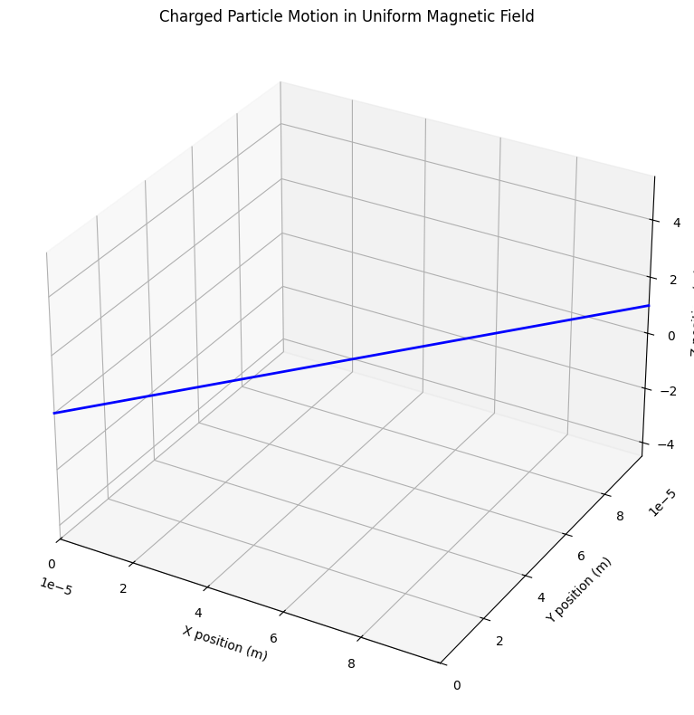
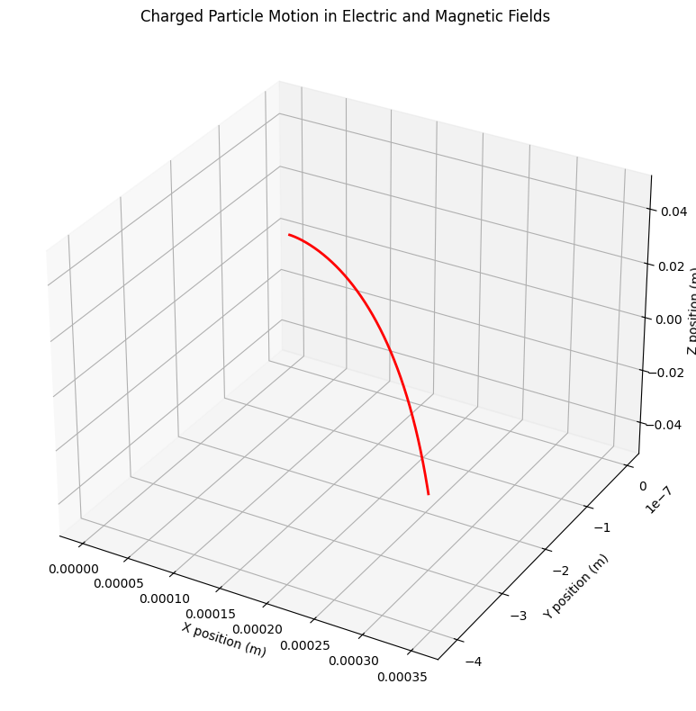
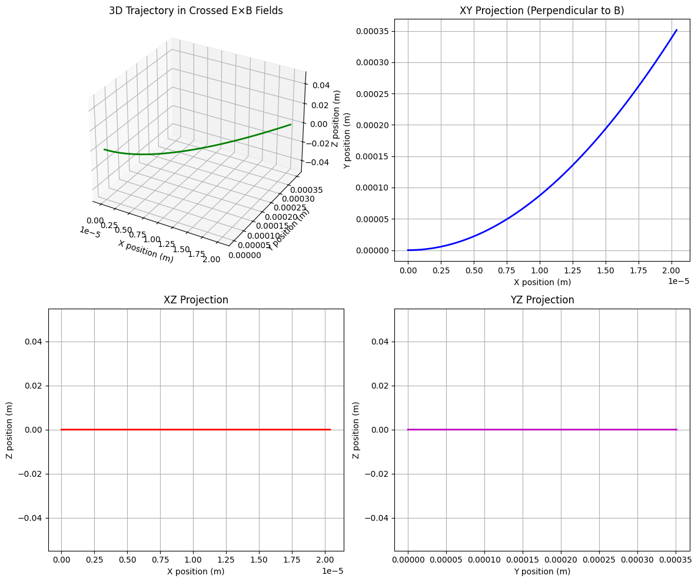
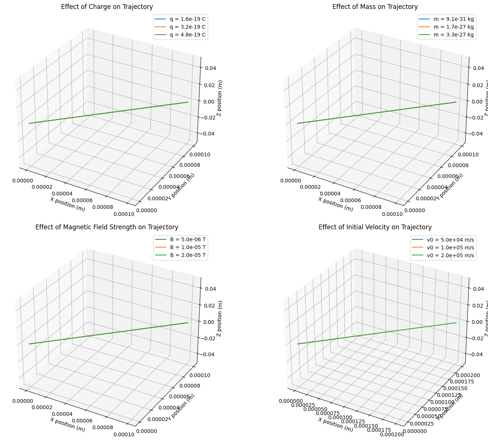

# Electromagnetism
## Problem 1: Simulating the Effects of the Lorentz Force

### Motivation

The Lorentz force, expressed as $\vec{F} = q(\vec{E} + \vec{v} \times \vec{B})$, governs the motion of charged particles in electric and magnetic fields. It is foundational in fields like plasma physics, particle accelerators, and astrophysics. By focusing on simulations, we can explore the practical applications and visualize the complex trajectories that arise due to this force.

### Task

#### 1. Exploration of Applications

The Lorentz force plays a crucial role in numerous scientific and technological applications:

- **Particle Accelerators**: Linear accelerators and cyclotrons use carefully designed electromagnetic fields to accelerate charged particles to high energies.
- **Mass Spectrometers**: These devices separate ions based on their charge-to-mass ratio using electromagnetic fields.
- **Plasma Confinement**: Magnetic fields confine plasma in fusion reactors through the Lorentz force.
- **Hall Thrusters**: Spacecraft propulsion systems that use crossed electric and magnetic fields to accelerate ions.
- **Magnetohydrodynamics (MHD)**: The study of electrically conducting fluids in magnetic fields.

Electric fields ($\vec{E}$) primarily accelerate charged particles along field lines, while magnetic fields ($\vec{B}$) cause charged particles to move in curved paths perpendicular to both the field and velocity directions. Together, they provide precise control over particle trajectories.

#### 2. Simulating Particle Motion

Let's implement simulations to visualize how charged particles behave under various field configurations.

##### 2.1 Uniform Magnetic Field

When a charged particle moves in a uniform magnetic field, it experiences a force perpendicular to both its velocity and the magnetic field. This results in circular motion if the particle's velocity is perpendicular to the field, or helical motion if there is a velocity component parallel to the field.

```python
import numpy as np
import matplotlib.pyplot as plt
from mpl_toolkits.mplot3d import Axes3D
from matplotlib.animation import FuncAnimation

def uniform_magnetic_field(q, m, B, v0, dt, steps):
    """
    Simulate particle motion in a uniform magnetic field.
    
    Parameters:
    q (float): Charge of the particle (C)
    m (float): Mass of the particle (kg)
    B (array): Magnetic field vector (T)
    v0 (array): Initial velocity vector (m/s)
    dt (float): Time step (s)
    steps (int): Number of simulation steps
    
    Returns:
    tuple: Arrays of positions and velocities
    """
    # Initialize arrays
    r = np.zeros((steps, 3))  # Position
    v = np.zeros((steps, 3))  # Velocity
    
    # Set initial conditions
    r[0] = np.array([0, 0, 0])
    v[0] = v0
    
    # Run simulation
    for i in range(1, steps):
        # Calculate Lorentz force: F = q(v × B)
        F = q * np.cross(v[i-1], B)
        
        # Update velocity: dv/dt = F/m
        v[i] = v[i-1] + F/m * dt
        
        # Update position: dr/dt = v
        r[i] = r[i-1] + v[i] * dt
    
    return r, v

# Set parameters
q = 1.602e-19  # Elementary charge (C)
m = 9.109e-31  # Electron mass (kg)
B = np.array([0, 0, 1e-5])  # Magnetic field in z-direction (T)
v0 = np.array([1e5, 1e5, 1e4])  # Initial velocity (m/s)
dt = 1e-12  # Time step (s)
steps = 1000  # Number of steps

# Run simulation
r, v = uniform_magnetic_field(q, m, B, v0, dt, steps)

# Create 3D plot
fig = plt.figure(figsize=(10, 8))
ax = fig.add_subplot(111, projection='3d')
ax.plot(r[:, 0], r[:, 1], r[:, 2], 'b-', linewidth=2)
ax.set_xlabel('X position (m)')
ax.set_ylabel('Y position (m)')
ax.set_zlabel('Z position (m)')
ax.set_title('Charged Particle Motion in Uniform Magnetic Field')

# Add magnetic field vectors for visualization
max_range = np.max([r[:, 0].max() - r[:, 0].min(),
                   r[:, 1].max() - r[:, 1].min(),
                   r[:, 2].max() - r[:, 2].min()]) / 2.0
mid_x = (r[:, 0].max() + r[:, 0].min()) / 2.0
mid_y = (r[:, 1].max() + r[:, 1].min()) / 2.0
mid_z = (r[:, 2].max() + r[:, 2].min()) / 2.0
ax.set_xlim(mid_x - max_range, mid_x + max_range)
ax.set_ylim(mid_y - max_range, mid_y + max_range)
ax.set_zlim(mid_z - max_range, mid_z + max_range)

# Calculate and print the Larmor radius
v_perp = np.sqrt(v0[0]**2 + v0[1]**2)  # Perpendicular velocity component
larmor_radius = m * v_perp / (q * np.linalg.norm(B))
print(f"Theoretical Larmor radius: {larmor_radius:.6e} m")

plt.tight_layout()
plt.show()
```



The simulation shows the helical trajectory of a charged particle in a uniform magnetic field. This motion can be characterized by:

- **Larmor Radius (Gyroradius)**: $r_L = \frac{mv_\perp}{|q|B}$, where $v_\perp$ is the velocity component perpendicular to the magnetic field.
- **Cyclotron Frequency**: $\omega_c = \frac{|q|B}{m}$, the angular frequency of the circular motion.
- **Pitch Angle**: The angle between the velocity vector and the magnetic field direction.

##### 2.2 Combined Uniform Electric and Magnetic Fields

When both electric and magnetic fields are present, the particle undergoes more complex motion determined by the full Lorentz force equation.

```python
def EB_fields(q, m, E, B, v0, dt, steps):
    """
    Simulate particle motion in uniform electric and magnetic fields.
    
    Parameters:
    q (float): Charge of the particle (C)
    m (float): Mass of the particle (kg)
    E (array): Electric field vector (V/m)
    B (array): Magnetic field vector (T)
    v0 (array): Initial velocity vector (m/s)
    dt (float): Time step (s)
    steps (int): Number of simulation steps
    
    Returns:
    tuple: Arrays of positions and velocities
    """
    # Initialize arrays
    r = np.zeros((steps, 3))  # Position
    v = np.zeros((steps, 3))  # Velocity
    
    # Set initial conditions
    r[0] = np.array([0, 0, 0])
    v[0] = v0
    
    # Run simulation
    for i in range(1, steps):
        # Calculate Lorentz force: F = q(E + v × B)
        F = q * (E + np.cross(v[i-1], B))
        
        # Update velocity: dv/dt = F/m
        v[i] = v[i-1] + F/m * dt
        
        # Update position: dr/dt = v
        r[i] = r[i-1] + v[i] * dt
    
    return r, v

# Set parameters
q = 1.602e-19  # Elementary charge (C)
m = 9.109e-31  # Electron mass (kg)
E = np.array([1e3, 0, 0])  # Electric field in x-direction (V/m)
B = np.array([0, 0, 1e-5])  # Magnetic field in z-direction (T)
v0 = np.array([0, 0, 0])  # Initial velocity (m/s)
dt = 1e-12  # Time step (s)
steps = 2000  # Number of steps

# Run simulation
r, v = EB_fields(q, m, E, B, v0, dt, steps)

# Create 3D plot
fig = plt.figure(figsize=(10, 8))
ax = fig.add_subplot(111, projection='3d')
ax.plot(r[:, 0], r[:, 1], r[:, 2], 'r-', linewidth=2)
ax.set_xlabel('X position (m)')
ax.set_ylabel('Y position (m)')
ax.set_zlabel('Z position (m)')
ax.set_title('Charged Particle Motion in Electric and Magnetic Fields')

# Add field vector annotations
max_range = np.max([r[:, 0].max() - r[:, 0].min(),
                   r[:, 1].max() - r[:, 1].min(),
                   r[:, 2].max() - r[:, 2].min()]) / 2.0
mid_x = (r[:, 0].max() + r[:, 0].min()) / 2.0
mid_y = (r[:, 1].max() + r[:, 1].min()) / 2.0
mid_z = (r[:, 2].max() + r[:, 2].min()) / 2.0

# Calculate the drift velocity
E_cross_B = np.cross(E, B)
B_squared = np.sum(B**2)
v_drift = E_cross_B / B_squared
print(f"Theoretical drift velocity: {v_drift} m/s")
print(f"Drift speed: {np.linalg.norm(v_drift):.2e} m/s")

plt.tight_layout()
plt.show()
```



When electric and magnetic fields are combined, the particle exhibits a drift motion. For perpendicular electric and magnetic fields, this is known as the **E×B drift** with velocity $\vec{v}_d = \frac{\vec{E} \times \vec{B}}{B^2}$. This drift is independent of the particle's charge and mass, which makes it particularly important in plasma physics.

##### 2.3 Crossed Electric and Magnetic Fields

Let's explore the specific case of perpendicular (crossed) electric and magnetic fields, which produces a characteristic drift motion.

```python
def crossed_EB_fields(q, m, E, B, v0, dt, steps):
    """
    Simulate particle motion in crossed E and B fields.
    
    Parameters:
    q (float): Charge of the particle (C)
    m (float): Mass of the particle (kg)
    E (array): Electric field vector (V/m)
    B (array): Magnetic field vector (T)
    v0 (array): Initial velocity vector (m/s)
    dt (float): Time step (s)
    steps (int): Number of simulation steps
    
    Returns:
    tuple: Arrays of positions and velocities
    """
    # Initialize arrays
    r = np.zeros((steps, 3))  # Position
    v = np.zeros((steps, 3))  # Velocity
    
    # Set initial conditions
    r[0] = np.array([0, 0, 0])
    v[0] = v0
    
    # Run simulation
    for i in range(1, steps):
        # Calculate Lorentz force: F = q(E + v × B)
        F = q * (E + np.cross(v[i-1], B))
        
        # Update velocity: dv/dt = F/m
        v[i] = v[i-1] + F/m * dt
        
        # Update position: dr/dt = v
        r[i] = r[i-1] + v[i] * dt
    
    return r, v

# Set parameters for crossed fields (E perpendicular to B)
q = 1.602e-19  # Elementary charge (C)
m = 9.109e-31  # Electron mass (kg)
E = np.array([0, 1e3, 0])  # Electric field in y-direction (V/m)
B = np.array([0, 0, 1e-5])  # Magnetic field in z-direction (T)
v0 = np.array([1e4, 0, 0])  # Initial velocity (m/s)
dt = 1e-12  # Time step (s)
steps = 2000  # Number of steps

# Run simulation
r, v = crossed_EB_fields(q, m, E, B, v0, dt, steps)

# Create plot
fig = plt.figure(figsize=(12, 10))

# 3D trajectory
ax1 = fig.add_subplot(221, projection='3d')
ax1.plot(r[:, 0], r[:, 1], r[:, 2], 'g-', linewidth=2)
ax1.set_xlabel('X position (m)')
ax1.set_ylabel('Y position (m)')
ax1.set_zlabel('Z position (m)')
ax1.set_title('3D Trajectory in Crossed E×B Fields')

# XY projection (perpendicular to B)
ax2 = fig.add_subplot(222)
ax2.plot(r[:, 0], r[:, 1], 'b-', linewidth=2)
ax2.set_xlabel('X position (m)')
ax2.set_ylabel('Y position (m)')
ax2.set_title('XY Projection (Perpendicular to B)')
ax2.grid(True)

# XZ projection
ax3 = fig.add_subplot(223)
ax3.plot(r[:, 0], r[:, 2], 'r-', linewidth=2)
ax3.set_xlabel('X position (m)')
ax3.set_ylabel('Z position (m)')
ax3.set_title('XZ Projection')
ax3.grid(True)

# YZ projection
ax4 = fig.add_subplot(224)
ax4.plot(r[:, 1], r[:, 2], 'm-', linewidth=2)
ax4.set_xlabel('Y position (m)')
ax4.set_ylabel('Z position (m)')
ax4.set_title('YZ Projection')
ax4.grid(True)

# Calculate the E×B drift velocity
E_cross_B = np.cross(E, B)
B_squared = np.sum(B**2)
v_drift = E_cross_B / B_squared
print(f"Theoretical E×B drift velocity: {v_drift} m/s")
print(f"Drift speed: {np.linalg.norm(v_drift):.2e} m/s")

plt.tight_layout()
plt.show()
```



The crossed-fields configuration is particularly important in many applications:

- **Hall Effect Devices**: Used in magnetic field sensors and Hall thrusters
- **Magnetrons**: Used in microwave generation for radar and microwave ovens
- **E×B Mass Filters**: Used in mass spectrometry
- **Plasma Propulsion**: Used in spacecraft engines

#### 3. Parameter Exploration

Let's create a simulation that allows us to explore how different parameters affect particle trajectories.

```python
def parameter_exploration(q_values, m_values, B_values, v0_values):
    """
    Explore how different parameters affect the particle trajectory in a magnetic field.
    
    Parameters:
    q_values (list): Different charge values to explore
    m_values (list): Different mass values to explore
    B_values (list): Different magnetic field strengths to explore
    v0_values (list): Different initial velocities to explore
    """
    # Fixed parameters
    dt = 1e-12  # Time step (s)
    steps = 1000  # Number of steps
    
    # Create figure
    fig = plt.figure(figsize=(16, 12))
    
    # 1. Varying charge
    ax1 = fig.add_subplot(221, projection='3d')
    for q in q_values:
        B = np.array([0, 0, 1e-5])  # Fixed B field
        v0 = np.array([1e5, 1e5, 0])  # Fixed initial velocity
        m = 9.109e-31  # Fixed mass (electron)
        
        r, _ = uniform_magnetic_field(q, m, B, v0, dt, steps)
        ax1.plot(r[:, 0], r[:, 1], r[:, 2], label=f'q = {q:.1e} C')
    
    ax1.set_xlabel('X position (m)')
    ax1.set_ylabel('Y position (m)')
    ax1.set_zlabel('Z position (m)')
    ax1.set_title('Effect of Charge on Trajectory')
    ax1.legend()
    
    # 2. Varying mass
    ax2 = fig.add_subplot(222, projection='3d')
    for m in m_values:
        B = np.array([0, 0, 1e-5])  # Fixed B field
        v0 = np.array([1e5, 1e5, 0])  # Fixed initial velocity
        q = 1.602e-19  # Fixed charge (electron)
        
        r, _ = uniform_magnetic_field(q, m, B, v0, dt, steps)
        ax2.plot(r[:, 0], r[:, 1], r[:, 2], label=f'm = {m:.1e} kg')
    
    ax2.set_xlabel('X position (m)')
    ax2.set_ylabel('Y position (m)')
    ax2.set_zlabel('Z position (m)')
    ax2.set_title('Effect of Mass on Trajectory')
    ax2.legend()
    
    # 3. Varying magnetic field strength
    ax3 = fig.add_subplot(223, projection='3d')
    for B_strength in B_values:
        B = np.array([0, 0, B_strength])  # B field in z-direction
        v0 = np.array([1e5, 1e5, 0])  # Fixed initial velocity
        q = 1.602e-19  # Fixed charge (electron)
        m = 9.109e-31  # Fixed mass (electron)
        
        r, _ = uniform_magnetic_field(q, m, B, v0, dt, steps)
        ax3.plot(r[:, 0], r[:, 1], r[:, 2], label=f'B = {B_strength:.1e} T')
    
    ax3.set_xlabel('X position (m)')
    ax3.set_ylabel('Y position (m)')
    ax3.set_zlabel('Z position (m)')
    ax3.set_title('Effect of Magnetic Field Strength on Trajectory')
    ax3.legend()
    
    # 4. Varying initial velocity
    ax4 = fig.add_subplot(224, projection='3d')
    for v0_mag in v0_values:
        B = np.array([0, 0, 1e-5])  # Fixed B field
        v0 = np.array([v0_mag, v0_mag, 0])  # Initial velocity in xy-plane
        q = 1.602e-19  # Fixed charge (electron)
        m = 9.109e-31  # Fixed mass (electron)
        
        r, _ = uniform_magnetic_field(q, m, B, v0, dt, steps)
        ax4.plot(r[:, 0], r[:, 1], r[:, 2], label=f'v0 = {v0_mag:.1e} m/s')
    
    ax4.set_xlabel('X position (m)')
    ax4.set_ylabel('Y position (m)')
    ax4.set_zlabel('Z position (m)')
    ax4.set_title('Effect of Initial Velocity on Trajectory')
    ax4.legend()
    
    plt.tight_layout()
    plt.show()

# Define parameter values to explore
q_values = [1.602e-19, 3.204e-19, 4.806e-19]  # Different charges (1e, 2e, 3e)
m_values = [9.109e-31, 1.673e-27, 3.343e-27]  # Different masses (electron, proton, deuteron)
B_values = [0.5e-5, 1.0e-5, 2.0e-5]  # Different magnetic field strengths
v0_values = [0.5e5, 1.0e5, 2.0e5]  # Different initial velocities

# Run parameter exploration
parameter_exploration(q_values, m_values, B_values, v0_values)
```



From this parameter exploration, we can observe:

1. **Effect of Charge (q)**:
   - Larger charge leads to smaller gyroradius
   - Increases the force and acceleration
   - The Larmor radius is inversely proportional to charge: $r_L \propto \frac{1}{q}$

2. **Effect of Mass (m)**:
   - Larger mass leads to larger gyroradius
   - Decreases acceleration for a given force
   - The Larmor radius is proportional to mass: $r_L \propto m$

3. **Effect of Magnetic Field Strength (B)**:
   - Stronger field leads to smaller gyroradius
   - Increases the force on the particle
   - The Larmor radius is inversely proportional to field strength: $r_L \propto \frac{1}{B}$

4. **Effect of Initial Velocity (v₀)**:
   - Higher velocity leads to larger gyroradius
   - The Larmor radius is proportional to perpendicular velocity: $r_L \propto v_\perp$


### Real-World Applications

The Lorentz force is fundamental to numerous technological and scientific applications:

#### 1. Cyclotrons and Particle Accelerators

Cyclotrons use the Lorentz force to accelerate charged particles in a spiral path. As particles gain energy, they move in increasingly larger circular paths due to the perpendicular magnetic field. The key principles include:

- Particles are accelerated by an electric field in gaps between "dees" (D-shaped electrodes)
- A perpendicular magnetic field keeps particles in a circular path
- The cyclotron frequency matches the orbital frequency of the particles

Modern accelerators like the Large Hadron Collider (LHC) use a more sophisticated arrangement of electromagnetic fields but still rely on the same fundamental physics.

#### 2. Mass Spectrometers

Mass spectrometers separate ions based on their charge-to-mass ratio using the Lorentz force. In a simple sector mass spectrometer:

- Ions are accelerated by an electric field
- A magnetic field causes ions to move in circular paths
- The radius of the path depends on the charge-to-mass ratio: $r = \frac{mv}{qB}$
- By measuring the deflection, the mass