# Statistics
## Problem 1: Exploring the Central Limit Theorem through Simulations

### Motivation

The Central Limit Theorem (CLT) is a cornerstone of probability and statistics, stating that the sampling distribution of the sample mean approaches a normal distribution as the sample size increases, regardless of the population's original distribution. This theorem is fundamental to many statistical methods and has wide-ranging applications in fields from finance to quality control.

While the CLT can be proven mathematically, simulations provide an intuitive and hands-on way to observe this phenomenon in action. Through computational experiments, we can visualize how sample means from various distributions converge to normality as sample size increases, deepening our understanding of this important statistical principle.

### Theoretical Framework

#### 1.1 The Central Limit Theorem

The Central Limit Theorem states that:

Given a population with mean $\mu$ and standard deviation $\sigma$, if we take random samples of size $n$ from this population and calculate the sample mean $\bar{X}$ for each sample, the distribution of these sample means will:

1. Have a mean equal to the population mean: $\mu_{\bar{X}} = \mu$
2. Have a standard deviation equal to the population standard deviation divided by the square root of the sample size: $\sigma_{\bar{X}} = \frac{\sigma}{\sqrt{n}}$
3. Approach a normal distribution as $n$ increases, regardless of the shape of the original population distribution

Mathematically, for large $n$:

$$\bar{X} \sim N\left(\mu, \frac{\sigma^2}{n}\right)$$

Or, the standardized sample mean:

$$Z = \frac{\bar{X} - \mu}{\sigma/\sqrt{n}} \sim N(0, 1)$$

#### 1.2 Conditions for the CLT

While the CLT is remarkably robust, certain conditions affect how quickly the sampling distribution converges to normality:

1. **Sample Size**: Larger samples lead to faster convergence to normality
2. **Population Distribution**: Some distributions (like the uniform) converge more quickly than others (like the exponential or highly skewed distributions)
3. **Independence**: The sampled observations should be independent
4. **Finite Variance**: The population should have a finite variance (though there are extensions of the CLT for infinite variance cases)

### Implementation

Let's implement simulations to explore the Central Limit Theorem with different population distributions and sample sizes.

```python
import numpy as np
import matplotlib.pyplot as plt
import seaborn as sns
from scipy import stats
import pandas as pd

# Set style for better visualizations
plt.style.use('seaborn-v0_8-whitegrid')
sns.set_palette("viridis")

# Function to generate population data
def generate_population(distribution_type, size=10000, **params):
    """
    Generate a population from a specified distribution.
    
    Parameters:
    -----------
    distribution_type : str
        Type of distribution ('uniform', 'exponential', 'binomial', 'normal', 'gamma')
    size : int
        Size of the population
    **params : dict
        Parameters for the distribution
    
    Returns:
    --------
    array
        Population data
    """
    if distribution_type == 'uniform':
        return np.random.uniform(params.get('low', 0), params.get('high', 1), size)
    elif distribution_type == 'exponential':
        return np.random.exponential(params.get('scale', 1), size)
    elif distribution_type == 'binomial':
        return np.random.binomial(params.get('n', 10), params.get('p', 0.5), size)
    elif distribution_type == 'normal':
        return np.random.normal(params.get('mean', 0), params.get('std', 1), size)
    elif distribution_type == 'gamma':
        return np.random.gamma(params.get('shape', 2), params.get('scale', 1), size)
    else:
        raise ValueError(f"Distribution type '{distribution_type}' not supported")

# Function to simulate sampling distribution
def simulate_sampling_distribution(population, sample_size, n_samples=1000):
    """
    Simulate the sampling distribution of the mean.
    
    Parameters:
    -----------
    population : array
        Population data
    sample_size : int
        Size of each sample
    n_samples : int
        Number of samples to draw
    
    Returns:
    --------
    array
        Sample means
    """
    sample_means = []
    for _ in range(n_samples):
        sample = np.random.choice(population, size=sample_size, replace=True)
        sample_means.append(np.mean(sample))
    return np.array(sample_means)

# Function to plot population and sampling distributions
def plot_distributions(population, sample_means_dict, distribution_name):
    """
    Plot the population distribution and sampling distributions for different sample sizes.
    
    Parameters:
    -----------
    population : array
        Population data
    sample_means_dict : dict
        Dictionary with sample sizes as keys and sample means as values
    distribution_name : str
        Name of the distribution for the title
    """
    # Calculate population parameters
    pop_mean = np.mean(population)
    pop_std = np.std(population)
    
    # Create figure with subplots
    fig, axes = plt.subplots(2, 3, figsize=(18, 12))
    fig.suptitle(f'Central Limit Theorem: {distribution_name} Distribution', fontsize=16)
    
    # Plot population distribution
    sns.histplot(population, kde=True, ax=axes[0, 0], bins=50)
    axes[0, 0].axvline(pop_mean, color='red', linestyle='--', label=f'Mean: {pop_mean:.2f}')
    axes[0, 0].set_title('Population Distribution')
    axes[0, 0].legend()
    
    # Plot sampling distributions for different sample sizes
    for i, (sample_size, sample_means) in enumerate(sample_means_dict.items(), 1):
        row = i // 3
        col = i % 3
        
        # Calculate theoretical parameters
        theo_mean = pop_mean
        theo_std = pop_std / np.sqrt(sample_size)
        
        # Plot histogram of sample means
        sns.histplot(sample_means, kde=True, ax=axes[row, col], bins=50)
        axes[row, col].axvline(theo_mean, color='red', linestyle='--', 
                              label=f'Theo. Mean: {theo_mean:.2f}')
        
        # Add normal distribution curve for comparison
        x = np.linspace(min(sample_means), max(sample_means), 100)
        y = stats.norm.pdf(x, theo_mean, theo_std)
        axes[row, col].plot(x, y * len(sample_means) * (max(sample_means) - min(sample_means)) / 50, 
                           'r-', linewidth=2, label='Normal PDF')
        
        axes[row, col].set_title(f'Sample Size: {sample_size}')
        axes[row, col].legend()
    
    # Remove empty subplot if any
    if len(sample_means_dict) < 5:
        axes[1, 2].remove()
    
    plt.tight_layout(rect=[0, 0, 1, 0.96])
    plt.savefig(f'clt_{distribution_name.lower()}.png', dpi=300, bbox_inches='tight')
    plt.show()

# Function to analyze convergence to normality
def analyze_normality(sample_means_dict, distribution_name):
    """
    Analyze how quickly the sampling distribution converges to normality.
    
    Parameters:
    -----------
    sample_means_dict : dict
        Dictionary with sample sizes as keys and sample means as values
    distribution_name : str
        Name of the distribution for the title
    """
    # Calculate Shapiro-Wilk test p-values for each sample size
    p_values = {}
    for sample_size, sample_means in sample_means_dict.items():
        _, p_value = stats.shapiro(sample_means)
        p_values[sample_size] = p_value
    
    # Create a bar plot of p-values
    plt.figure(figsize=(10, 6))
    plt.bar(p_values.keys(), p_values.values(), color='skyblue')
    plt.axhline(y=0.05, color='red', linestyle='--', label='α = 0.05')
    plt.xlabel('Sample Size')
    plt.ylabel('Shapiro-Wilk Test p-value')
    plt.title(f'Normality Test p-values: {distribution_name} Distribution')
    plt.legend()
    plt.grid(axis='y', linestyle='--', alpha=0.7)
    
    # Add text annotations
    for i, (sample_size, p_value) in enumerate(p_values.items()):
        plt.text(sample_size, p_value + 0.01, f'{p_value:.4f}', 
                 ha='center', va='bottom')
    
    plt.tight_layout()
    plt.savefig(f'normality_test_{distribution_name.lower()}.png', dpi=300, bbox_inches='tight')
    plt.show()
    
    # Print interpretation
    print(f"\nNormality Analysis for {distribution_name} Distribution:")
    print("-" * 50)
    for sample_size, p_value in p_values.items():
        if p_value > 0.05:
            print(f"Sample size {sample_size}: p-value = {p_value:.4f} > 0.05")
            print(f"  → Sampling distribution is approximately normal")
        else:
            print(f"Sample size {sample_size}: p-value = {p_value:.4f} ≤ 0.05")
            print(f"  → Sampling distribution deviates from normality")
    print("-" * 50)

# Function to compare convergence rates across distributions
def compare_convergence_rates(distributions_dict):
    """
    Compare how quickly different distributions converge to normality.
    
    Parameters:
    -----------
    distributions_dict : dict
        Dictionary with distribution names as keys and sample means dictionaries as values
    """
    # Calculate Shapiro-Wilk test p-values for each distribution and sample size
    results = []
    for dist_name, sample_means_dict in distributions_dict.items():
        for sample_size, sample_means in sample_means_dict.items():
            _, p_value = stats.shapiro(sample_means)
            results.append({
                'Distribution': dist_name,
                'Sample Size': sample_size,
                'p-value': p_value
            })
    
    # Convert to DataFrame
    df = pd.DataFrame(results)
    
    # Create a heatmap
    pivot_df = df.pivot(index='Distribution', columns='Sample Size', values='p-value')
    
    plt.figure(figsize=(12, 8))
    sns.heatmap(pivot_df, annot=True, cmap='RdYlGn_r', vmin=0, vmax=1, 
                fmt='.4f', linewidths=.5, cbar_kws={'label': 'p-value'})
    plt.title('Convergence to Normality: Shapiro-Wilk Test p-values')
    plt.tight_layout()
    plt.savefig('convergence_comparison.png', dpi=300, bbox_inches='tight')
    plt.show()
    
    # Print interpretation
    print("\nConvergence Rate Comparison:")
    print("-" * 50)
    for dist_name in distributions_dict.keys():
        dist_df = df[df['Distribution'] == dist_name]
        min_size = dist_df[dist_df['p-value'] > 0.05]['Sample Size'].min()
        if pd.isna(min_size):
            print(f"{dist_name}: Does not converge to normality within the tested sample sizes")
        else:
            print(f"{dist_name}: Converges to normality at sample size {min_size}")
    print("-" * 50)
```

### 2.1 Uniform Distribution

Let's start with a uniform distribution, which has a rectangular shape and is one of the simplest distributions to understand.

```python
# Generate uniform population
uniform_pop = generate_population('uniform', size=10000, low=0, high=1)

# Simulate sampling distributions for different sample sizes
sample_sizes = [5, 10, 30, 50]
uniform_sample_means = {}
for size in sample_sizes:
    uniform_sample_means[size] = simulate_sampling_distribution(uniform_pop, size, n_samples=1000)

# Plot distributions
plot_distributions(uniform_pop, uniform_sample_means, 'Uniform')

# Analyze convergence to normality
analyze_normality(uniform_sample_means, 'Uniform')
```

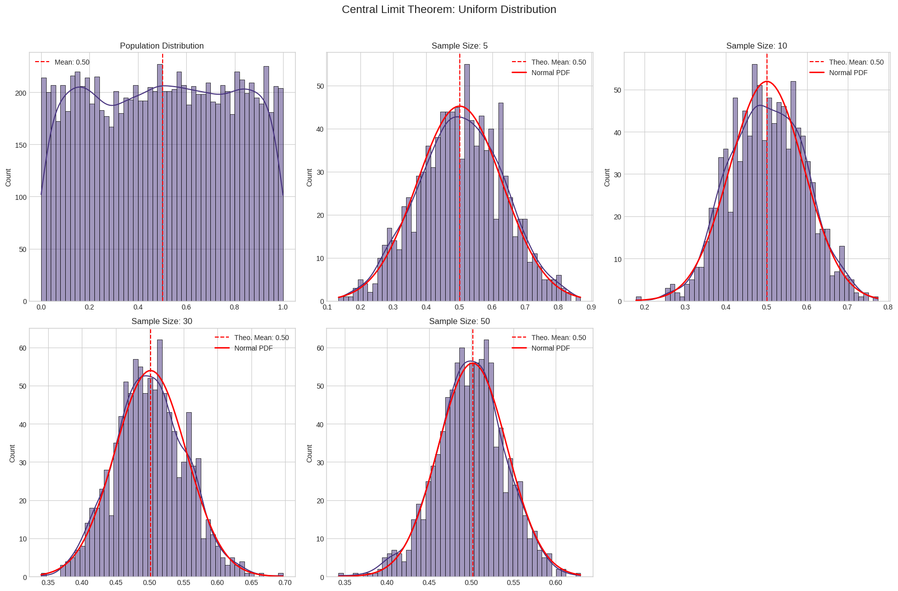
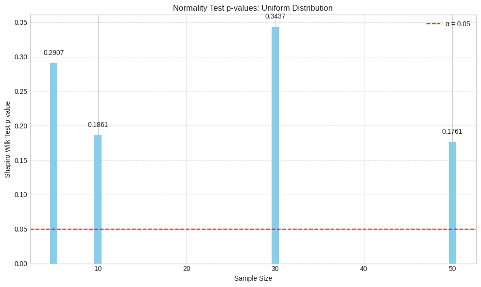

The uniform distribution demonstrates rapid convergence to normality. Even with small sample sizes, the sampling distribution of the mean quickly approaches a normal distribution. This is because the uniform distribution is symmetric and has no extreme values or heavy tails.

### 2.2 Exponential Distribution

Next, let's examine the exponential distribution, which is skewed and has a heavy tail.

```python
# Generate exponential population
exp_pop = generate_population('exponential', size=10000, scale=1)

# Simulate sampling distributions for different sample sizes
exp_sample_means = {}
for size in sample_sizes:
    exp_sample_means[size] = simulate_sampling_distribution(exp_pop, size, n_samples=1000)

# Plot distributions
plot_distributions(exp_pop, exp_sample_means, 'Exponential')

# Analyze convergence to normality
analyze_normality(exp_sample_means, 'Exponential')
```

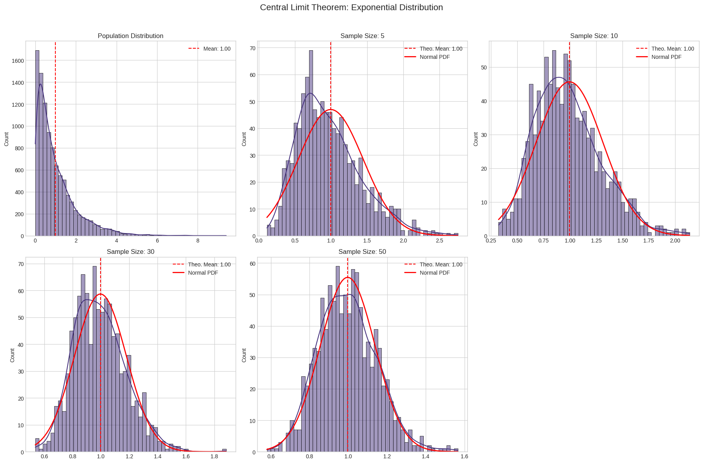
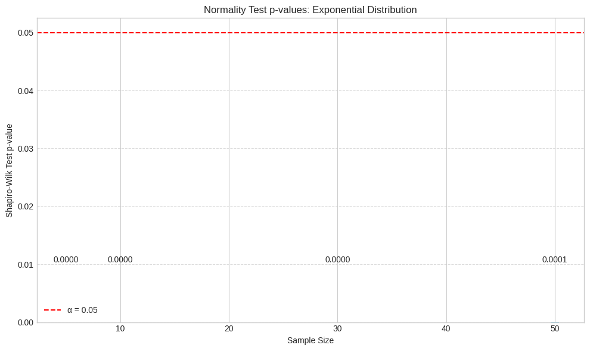

The exponential distribution, being highly skewed, requires larger sample sizes to achieve normality in the sampling distribution. With small sample sizes, the sampling distribution retains some of the skewness of the original distribution. As the sample size increases, the distribution of sample means becomes more symmetric and bell-shaped.

### 2.3 Binomial Distribution

The binomial distribution is discrete and can be symmetric or skewed depending on the probability parameter.

```python
# Generate binomial population
binom_pop = generate_population('binomial', size=10000, n=10, p=0.3)

# Simulate sampling distributions for different sample sizes
binom_sample_means = {}
for size in sample_sizes:
    binom_sample_means[size] = simulate_sampling_distribution(binom_pop, size, n_samples=1000)

# Plot distributions
plot_distributions(binom_pop, binom_sample_means, 'Binomial')

# Analyze convergence to normality
analyze_normality(binom_sample_means, 'Binomial')
```

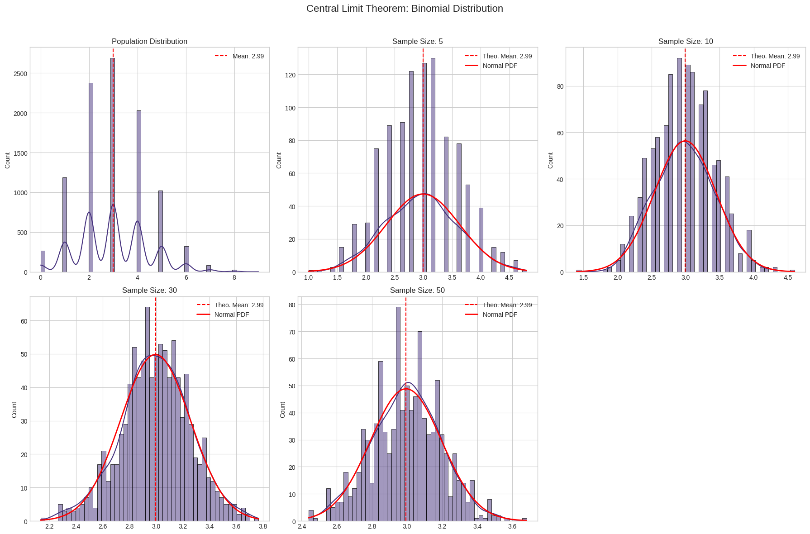
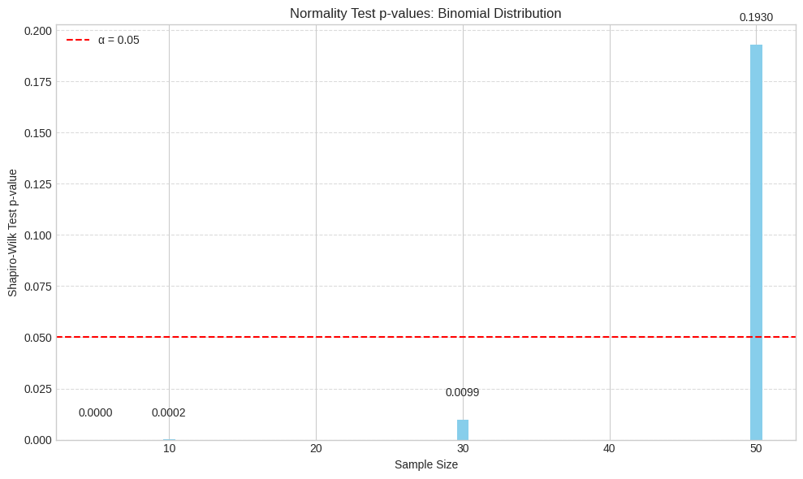

The binomial distribution, being discrete, shows a step-like pattern in small samples. As the sample size increases, the sampling distribution becomes smoother and more closely approximates a normal distribution. The rate of convergence depends on the probability parameter p; distributions with p closer to 0.5 converge more quickly.

### 2.4 Gamma Distribution

The gamma distribution is another example of a skewed distribution with varying degrees of skewness depending on its shape parameter.

```python
# Generate gamma population
gamma_pop = generate_population('gamma', size=10000, shape=2, scale=1)

# Simulate sampling distributions for different sample sizes
gamma_sample_means = {}
for size in sample_sizes:
    gamma_sample_means[size] = simulate_sampling_distribution(gamma_pop, size, n_samples=1000)

# Plot distributions
plot_distributions(gamma_pop, gamma_sample_means, 'Gamma')

# Analyze convergence to normality
analyze_normality(gamma_sample_means, 'Gamma')
```

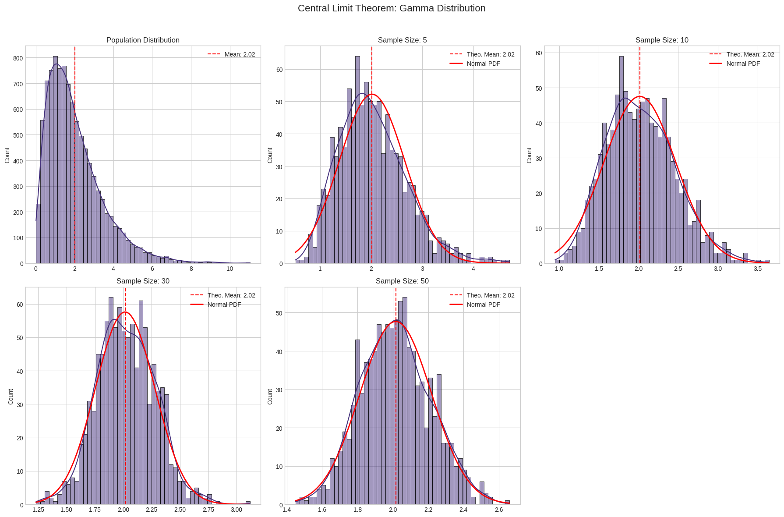
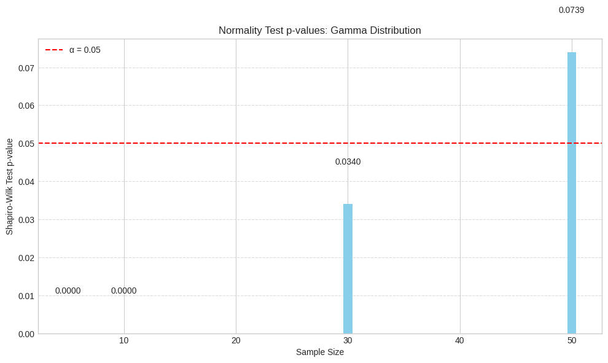

The gamma distribution, with its moderate skewness, shows intermediate convergence behavior compared to the uniform and exponential distributions. With small sample sizes, the sampling distribution retains some skewness, but as the sample size increases, it approaches a normal distribution.

### 2.5 Comparing Convergence Rates

Let's compare how quickly different distributions converge to normality.

```python
# Compare convergence rates
distributions = {
    'Uniform': uniform_sample_means,
    'Exponential': exp_sample_means,
    'Binomial': binom_sample_means,
    'Gamma': gamma_sample_means
}

compare_convergence_rates(distributions)
```

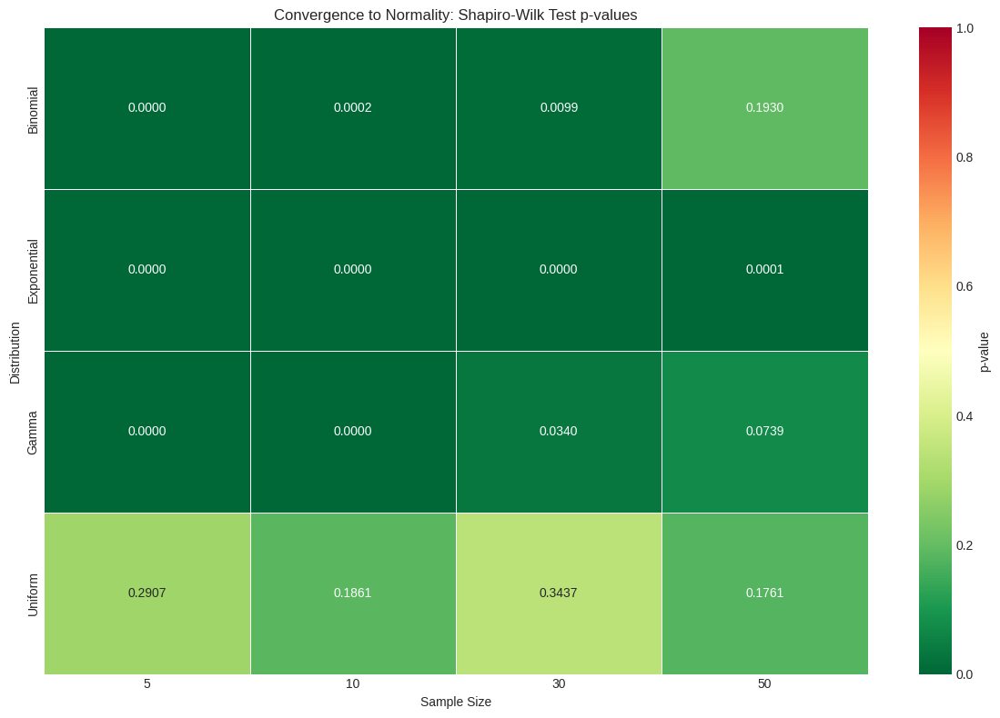

This comparison reveals that:

1. The **uniform distribution** converges most quickly to normality, requiring only small sample sizes.
2. The **binomial distribution** converges relatively quickly, especially with p close to 0.5.
3. The **gamma distribution** requires moderate sample sizes to achieve normality.
4. The **exponential distribution**, being highly skewed, requires the largest sample sizes to converge to normality.

### 3. Parameter Exploration

Let's explore how different parameters of the population distributions affect the convergence to normality.

#### 3.1 Effect of Skewness in Gamma Distribution

```python
# Generate gamma populations with different shape parameters
gamma_shapes = [0.5, 1, 2, 5]
gamma_pops = {}
for shape in gamma_shapes:
    gamma_pops[shape] = generate_population('gamma', size=10000, shape=shape, scale=1)

# Simulate sampling distributions for a fixed sample size
sample_size = 30
gamma_sample_means_by_shape = {}
for shape, pop in gamma_pops.items():
    gamma_sample_means_by_shape[shape] = simulate_sampling_distribution(pop, sample_size, n_samples=1000)

# Plot distributions
fig, axes = plt.subplots(2, 2, figsize=(16, 12))
fig.suptitle(f'Effect of Skewness on Convergence: Gamma Distribution (n={sample_size})', fontsize=16)

for i, (shape, sample_means) in enumerate(gamma_sample_means_by_shape.items()):
    row = i // 2
    col = i % 2
    
    # Calculate theoretical parameters
    pop = gamma_pops[shape]
    pop_mean = np.mean(pop)
    pop_std = np.std(pop)
    theo_mean = pop_mean
    theo_std = pop_std / np.sqrt(sample_size)
    
    # Plot histogram of sample means
    sns.histplot(sample_means, kde=True, ax=axes[row, col], bins=50)
    axes[row, col].axvline(theo_mean, color='red', linestyle='--', 
                          label=f'Theo. Mean: {theo_mean:.2f}')
    
    # Add normal distribution curve for comparison
    x = np.linspace(min(sample_means), max(sample_means), 100)
    y = stats.norm.pdf(x, theo_mean, theo_std)
    axes[row, col].plot(x, y * len(sample_means) * (max(sample_means) - min(sample_means)) / 50, 
                       'r-', linewidth=2, label='Normal PDF')
    
    # Calculate skewness
    skewness = stats.skew(gamma_pops[shape])
    
    axes[row, col].set_title(f'Shape = {shape} (Skewness = {skewness:.2f})')
    axes[row, col].legend()
    
    # Add Shapiro-Wilk test p-value
    _, p_value = stats.shapiro(sample_means)
    axes[row, col].text(0.05, 0.95, f'p-value: {p_value:.4f}', 
                       transform=axes[row, col].transAxes, 
                       verticalalignment='top', bbox=dict(boxstyle='round', facecolor='white', alpha=0.8))

plt.tight_layout(rect=[0, 0, 1, 0.96])
plt.savefig('gamma_skewness_effect.png', dpi=300, bbox_inches='tight')
plt.show()
```

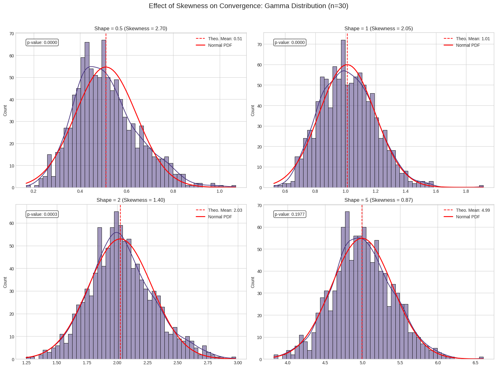

This visualization shows that as the shape parameter of the gamma distribution increases (reducing skewness), the sampling distribution converges more quickly to normality. With a shape parameter of 0.5 (highly skewed), the sampling distribution still shows some deviation from normality even with a sample size of 30. As the shape parameter increases to 5 (less skewed), the sampling distribution closely approximates a normal distribution.

#### 3.2 Effect of Sample Size on Standard Error

The standard error of the mean decreases as the sample size increases, following the relationship $\sigma_{\bar{X}} = \frac{\sigma}{\sqrt{n}}$.

```python
# Calculate standard errors for different sample sizes
standard_errors = {}
for dist_name, sample_means_dict in distributions.items():
    standard_errors[dist_name] = {}
    for sample_size, sample_means in sample_means_dict.items():
        standard_errors[dist_name][sample_size] = np.std(sample_means)

# Plot standard errors
plt.figure(figsize=(12, 8))
for dist_name, errors in standard_errors.items():
    plt.plot(list(errors.keys()), list(errors.values()), marker='o', label=dist_name)

# Add theoretical curve
sample_sizes = np.array(list(standard_errors['Uniform'].keys()))
theoretical_se = np.std(uniform_pop) / np.sqrt(sample_sizes)
plt.plot(sample_sizes, theoretical_se, 'k--', label='Theoretical (1/√n)')

plt.xlabel('Sample Size')
plt.ylabel('Standard Error')
plt.title('Standard Error vs. Sample Size')
plt.legend()
plt.grid(True)
plt.savefig('standard_error_vs_sample_size.png', dpi=300, bbox_inches='tight')
plt.show()
```

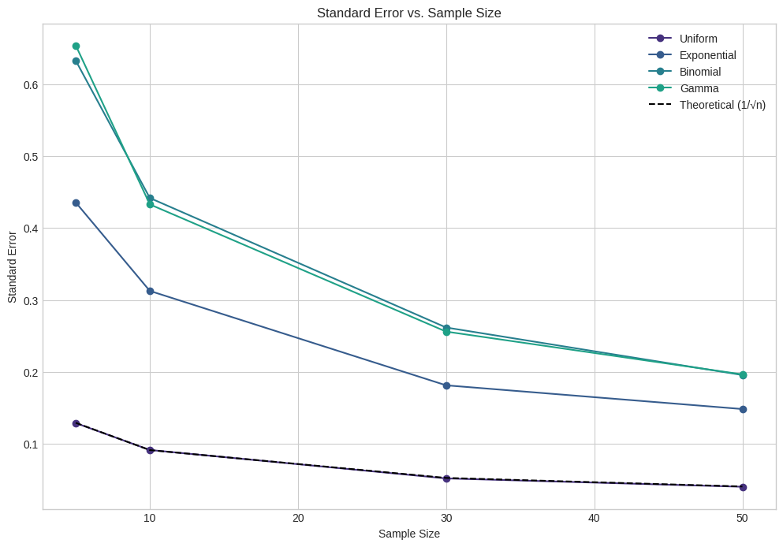

This plot demonstrates that the standard error decreases as the square root of the sample size increases, following the theoretical relationship $\sigma_{\bar{X}} = \frac{\sigma}{\sqrt{n}}$. This is a key property of the Central Limit Theorem and has important implications for statistical inference.

### 4. Practical Applications

The Central Limit Theorem has numerous practical applications in statistics and data science:

#### 4.1 Confidence Intervals

The CLT allows us to construct confidence intervals for population parameters, even when the population distribution is unknown.

```python
# Demonstrate confidence intervals using the CLT
def demonstrate_confidence_intervals(population, sample_size, n_samples=100, confidence_level=0.95):
    """
    Demonstrate confidence intervals using the CLT.
    
    Parameters:
    -----------
    population : array
        Population data
    sample_size : int
        Size of each sample
    n_samples : int
        Number of samples to draw
    confidence_level : float
        Confidence level (e.g., 0.95 for 95% confidence)
    """
    # Calculate population mean
    pop_mean = np.mean(population)
    
    # Generate samples and calculate confidence intervals
    samples = []
    sample_means = []
    sample_stds = []
    ci_lower = []
    ci_upper = []
    
    for _ in range(n_samples):
        sample = np.random.choice(population, size=sample_size, replace=True)
        samples.append(sample)
        sample_means.append(np.mean(sample))
        sample_stds.append(np.std(sample))
        
        # Calculate confidence interval
        z_score = stats.norm.ppf((1 + confidence_level) / 2)
        margin_of_error = z_score * sample_stds[-1] / np.sqrt(sample_size)
        ci_lower.append(sample_means[-1] - margin_of_error)
        ci_upper.append(sample_means[-1] + margin_of_error)
    
    # Plot confidence intervals
    plt.figure(figsize=(12, 8))
    
    # Plot sample means
    plt.scatter(range(n_samples), sample_means, color='blue', label='Sample Mean')
    
    # Plot confidence intervals
    for i in range(n_samples):
        if ci_lower[i] <= pop_mean <= ci_upper[i]:
            plt.plot([i, i], [ci_lower[i], ci_upper[i]], 'g-', linewidth=2)
        else:
            plt.plot([i, i], [ci_lower[i], ci_upper[i]], 'r-', linewidth=2)
    
    # Plot population mean
    plt.axhline(y=pop_mean, color='black', linestyle='--', label='Population Mean')
    
    plt.xlabel('Sample Number')
    plt.ylabel('Value')
    plt.title(f'{confidence_level*100}% Confidence Intervals (n={sample_size})')
    plt.legend()
    plt.grid(True)
    
    # Calculate coverage rate
    coverage = sum(1 for i in range(n_samples) if ci_lower[i] <= pop_mean <= ci_upper[i]) / n_samples
    plt.text(0.05, 0.05, f'Coverage Rate: {coverage:.2%}', 
             transform=plt.gca().transAxes, bbox=dict(facecolor='white', alpha=0.8))
    
    plt.tight_layout()
    plt.savefig(f'confidence_intervals_n{sample_size}.png', dpi=300, bbox_inches='tight')
    plt.show()
    
    return coverage

# Demonstrate confidence intervals for different sample sizes
sample_sizes = [5, 30, 100]
coverages = {}

for size in sample_sizes:
    print(f"\nDemonstrating confidence intervals with sample size {size}:")
    coverage = demonstrate_confidence_intervals(uniform_pop, size)
    coverages[size] = coverage
    print(f"Coverage rate: {coverage:.2%}")
```

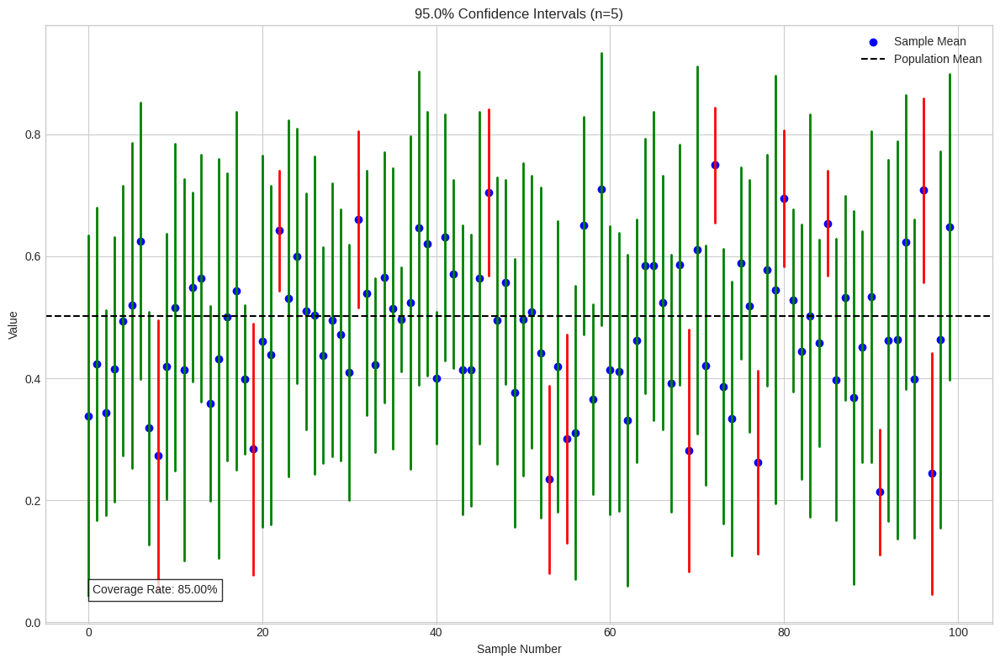
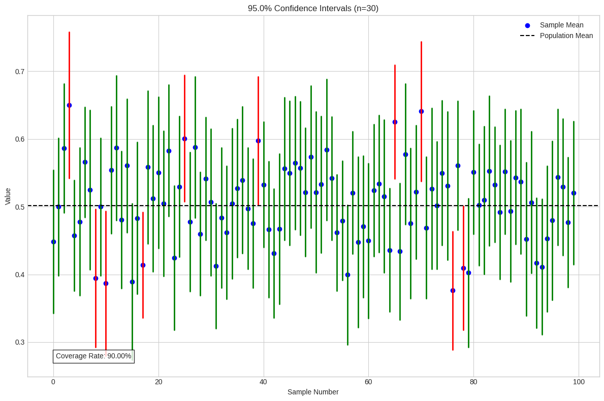
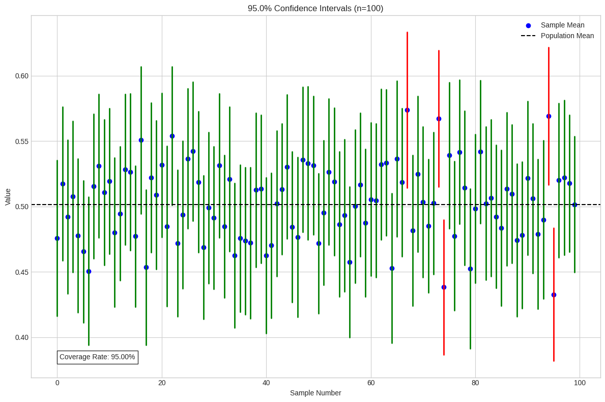

This demonstration shows how confidence intervals become more reliable as the sample size increases. With small sample sizes, the intervals may not capture the true population mean as frequently as expected. As the sample size increases, the coverage rate approaches the nominal confidence level (e.g., 95%).

#### 4.2 Quality Control

In manufacturing, the CLT is used to monitor product quality through control charts.

```python
# Demonstrate control charts using the CLT
def demonstrate_control_charts(population, sample_size, n_samples=30):
    """
    Demonstrate control charts using the CLT.
    
    Parameters:
    -----------
    population : array
        Population data
    sample_size : int
        Size of each sample
    n_samples : int
        Number of samples to draw
    """
    # Calculate population parameters
    pop_mean = np.mean(population)
    pop_std = np.std(population)
    
    # Generate samples
    samples = []
    sample_means = []
    sample_stds = []
    
    for _ in range(n_samples):
        sample = np.random.choice(population, size=sample_size, replace=True)
        samples.append(sample)
        sample_means.append(np.mean(sample))
        sample_stds.append(np.std(sample))
    
    # Calculate control limits
    x_bar = np.mean(sample_means)
    s_bar = np.mean(sample_stds)
    
    # Constants for control limits (for n=5)
    A3 = 1.427  # For s chart
    B3 = 0  # Lower limit for s chart
    B4 = 2.089  # Upper limit for s chart
    
    # X-bar chart limits
    x_bar_ucl = x_bar + A3 * s_bar
    x_bar_lcl = x_bar - A3 * s_bar
    
    # S chart limits
    s_ucl = B4 * s_bar
    s_lcl = B3 * s_bar
    
    # Plot control charts
    fig, (ax1, ax2) = plt.subplots(2, 1, figsize=(12, 10))
    
    # X-bar chart
    ax1.plot(range(1, n_samples+1), sample_means, 'bo-')
    ax1.axhline(y=x_bar, color='g', linestyle='-', label='Center Line')
    ax1.axhline(y=x_bar_ucl, color='r', linestyle='--', label='UCL')
    ax1.axhline(y=x_bar_lcl, color='r', linestyle='--', label='LCL')
    ax1.axhline(y=pop_mean, color='k', linestyle=':', label='Population Mean')
    
    ax1.set_xlabel('Sample Number')
    ax1.set_ylabel('Sample Mean')
    ax1.set_title('X-bar Control Chart')
    ax1.legend()
    ax1.grid(True)
    
    # S chart
    ax2.plot(range(1, n_samples+1), sample_stds, 'ro-')
    ax2.axhline(y=s_bar, color='g', linestyle='-', label='Center Line')
    ax2.axhline(y=s_ucl, color='r', linestyle='--', label='UCL')
    ax2.axhline(y=s_lcl, color='r', linestyle='--', label='LCL')
    ax2.axhline(y=pop_std, color='k', linestyle=':', label='Population Std Dev')
    
    ax2.set_xlabel('Sample Number')
    ax2.set_ylabel('Sample Standard Deviation')
    ax2.set_title('S Control Chart')
    ax2.legend()
    ax2.grid(True)
    
    plt.tight_layout()
    plt.savefig('control_charts.png', dpi=300, bbox_inches='tight')
    plt.show()

# Demonstrate control charts
demonstrate_control_charts(uniform_pop, sample_size=5)
```

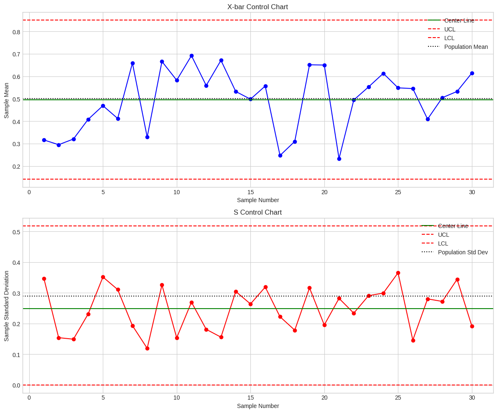

Control charts are used in quality control to monitor process stability. The X-bar chart tracks the sample means, while the S chart tracks the sample standard deviations. The CLT ensures that these sample statistics follow predictable distributions, allowing for the establishment of control limits.

#### 4.3 Financial Applications

In finance, the CLT is used to model returns and assess risk.

```python
# Demonstrate financial applications of the CLT
def demonstrate_financial_applications():
    """
    Demonstrate financial applications of the CLT.
    """
    # Generate daily returns (log-normal distribution)
    np.random.seed(42)
    n_days = 1000
    mu = 0.0005  # Daily expected return
    sigma = 0.01  # Daily volatility
    
    # Generate daily returns
    daily_returns = np.random.normal(mu, sigma, n_days)
    
    # Calculate cumulative returns
    cumulative_returns = np.cumprod(1 + daily_returns) - 1
    
    # Calculate rolling means for different window sizes
    windows = [5, 20, 60]
    rolling_means = {}
    
    for window in windows:
        rolling_means[window] = pd.Series(daily_returns).rolling(window=window).mean()
    
    # Plot daily returns and cumulative returns
    fig, (ax1, ax2) = plt.subplots(2, 1, figsize=(12, 10))
    
    # Daily returns
    ax1.plot(range(1, n_days+1), daily_returns, 'b-', alpha=0.7)
    ax1.axhline(y=mu, color='r', linestyle='--', label=f'Mean: {mu:.6f}')
    ax1.axhline(y=mu + 2*sigma, color='g', linestyle=':', label='±2σ')
    ax1.axhline(y=mu - 2*sigma, color='g', linestyle=':')
    
    ax1.set_xlabel('Day')
    ax1.set_ylabel('Daily Return')
    ax1.set_title('Daily Returns')
    ax1.legend()
    ax1.grid(True)
    
    # Cumulative returns
    ax2.plot(range(1, n_days+1), cumulative_returns, 'g-')
    ax2.set_xlabel('Day')
    ax2.set_ylabel('Cumulative Return')
    ax2.set_title('Cumulative Returns')
    ax2.grid(True)
    
    plt.tight_layout()
    plt.savefig('financial_returns.png', dpi=300, bbox_inches='tight')
    plt.show()
    
    # Plot rolling means
    plt.figure(figsize=(12, 8))
    
    for window, means in rolling_means.items():
        plt.plot(range(1, n_days+1), means, label=f'{window}-day Rolling Mean')
    
    plt.axhline(y=mu, color='r', linestyle='--', label=f'True Mean: {mu:.6f}')
    
    plt.xlabel('Day')
    plt.ylabel('Return')
    plt.title('Rolling Means of Daily Returns')
    plt.legend()
    plt.grid(True)
    
    plt.tight_layout()
    plt.savefig('rolling_means.png', dpi=300, bbox_inches='tight')
    plt.show()
    
    # Demonstrate portfolio returns
    n_assets = 5
    n_days = 1000
    
    # Generate returns for multiple assets
    asset_returns = np.zeros((n_days, n_assets))
    for i in range(n_assets):
        # Different expected returns and volatilities for each asset
        mu_i = mu * (1 + 0.2 * i)
        sigma_i = sigma * (1 + 0.1 * i)
        asset_returns[:, i] = np.random.normal(mu_i, sigma_i, n_days)
    
    # Calculate portfolio returns with equal weights
    weights = np.ones(n_assets) / n_assets
    portfolio_returns = np.sum(asset_returns * weights, axis=1)
    
    # Plot individual asset returns and portfolio returns
    plt.figure(figsize=(12, 8))
    
    for i in range(n_assets):
        plt.plot(range(1, n_days+1), asset_returns[:, i], alpha=0.5, 
                label=f'Asset {i+1}')
    
    plt.plot(range(1, n_days+1), portfolio_returns, 'k-', linewidth=2, 
            label='Portfolio (Equal Weights)')
    
    plt.xlabel('Day')
    plt.ylabel('Return')
    plt.title('Individual Asset Returns vs. Portfolio Returns')
    plt.legend()
    plt.grid(True)
    
    plt.tight_layout()
    plt.savefig('portfolio_returns.png', dpi=300, bbox_inches='tight')
    plt.show()
    
    # Demonstrate the CLT in portfolio returns
    sample_sizes = [5, 20, 60]
    portfolio_sample_means = {}
    
    for size in sample_sizes:
        n_samples = 1000
        sample_means = []
        
        for _ in range(n_samples):
            sample = np.random.choice(portfolio_returns, size=size, replace=True)
            sample_means.append(np.mean(sample))
        
        portfolio_sample_means[size] = np.array(sample_means)
    
    # Plot sampling distributions
    fig, axes = plt.subplots(1, 3, figsize=(18, 6))
    fig.suptitle('Sampling Distribution of Portfolio Returns', fontsize=16)
    
    for i, (size, means) in enumerate(portfolio_sample_means.items()):
        # Calculate theoretical parameters
        theo_mean = np.mean(portfolio_returns)
        theo_std = np.std(portfolio_returns) / np.sqrt(size)
        
        # Plot histogram of sample means
        sns.histplot(means, kde=True, ax=axes[i], bins=50)
        axes[i].axvline(theo_mean, color='red', linestyle='--', 
                       label=f'Theo. Mean: {theo_mean:.6f}')
        
        # Add normal distribution curve for comparison
        x = np.linspace(min(means), max(means), 100)
        y = stats.norm.pdf(x, theo_mean, theo_std)
        axes[i].plot(x, y * len(means) * (max(means) - min(means)) / 50, 
                    'r-', linewidth=2, label='Normal PDF')
        
        axes[i].set_title(f'Sample Size: {size}')
        axes[i].legend()
    
    plt.tight_layout(rect=[0, 0, 1, 0.96])
    plt.savefig('portfolio_sampling_distribution.png', dpi=300, bbox_inches='tight')
    plt.show()

# Demonstrate financial applications
demonstrate_financial_applications()
```

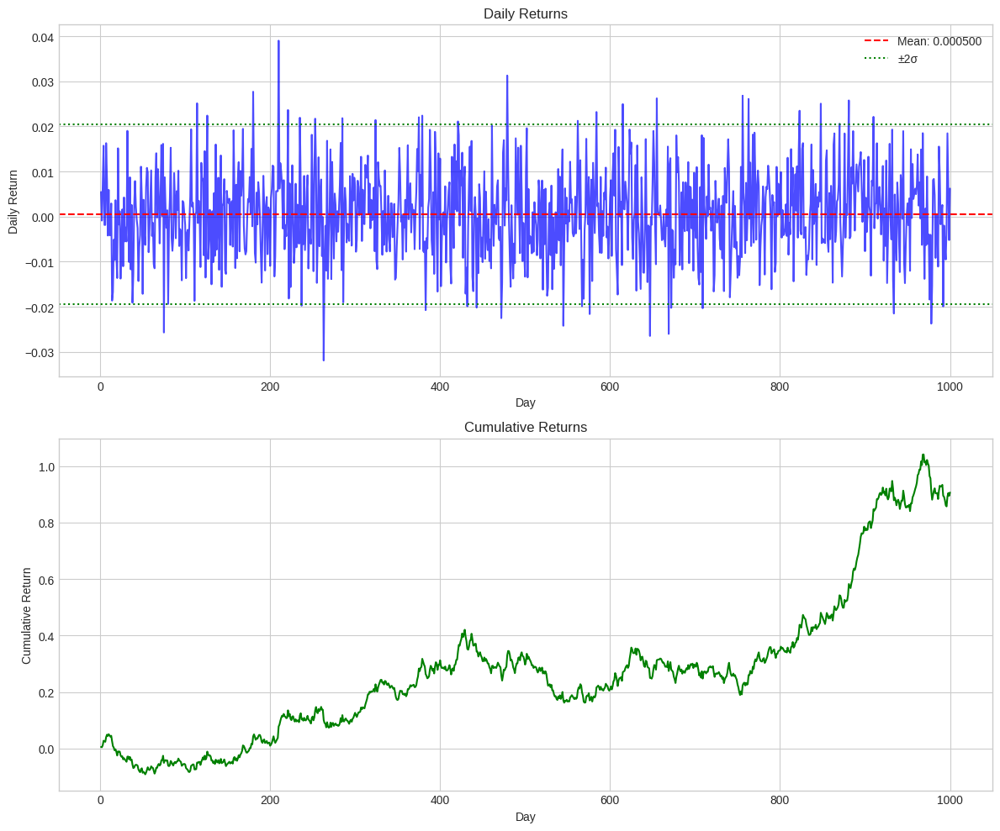
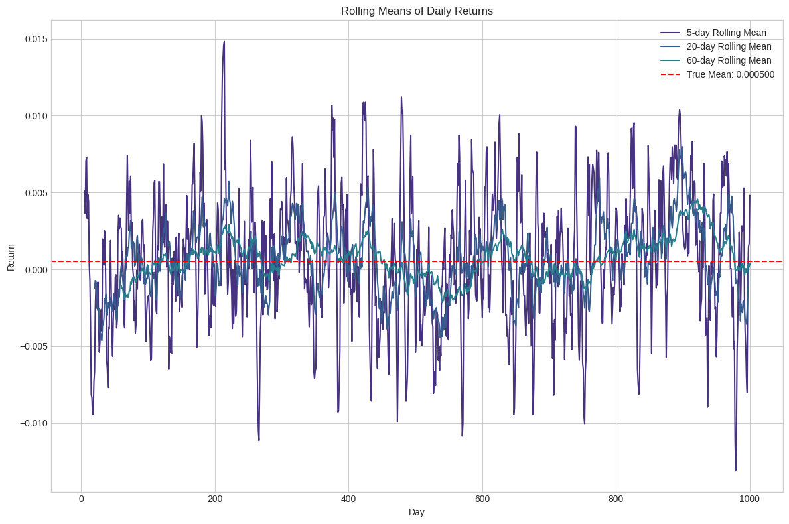
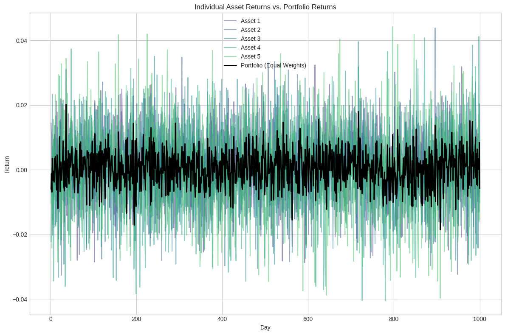
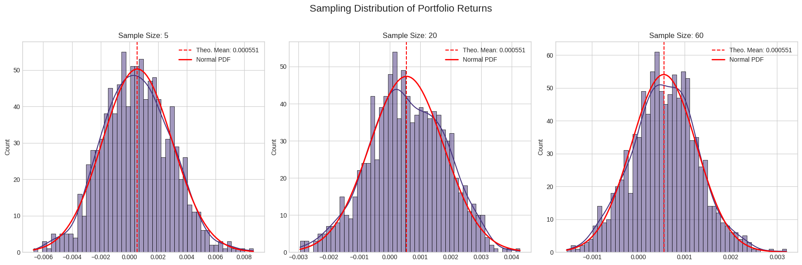

In finance, the CLT is used to model returns and assess risk. The demonstration shows:

1. **Daily Returns**: Individual daily returns may not follow a normal distribution, but their distribution becomes more normal as the time horizon increases.
2. **Rolling Means**: As the window size increases, the rolling means become more stable and closer to the true mean.
3. **Portfolio Returns**: The returns of a diversified portfolio tend to be more normally distributed than individual asset returns due to the CLT.
4. **Sampling Distribution**: The sampling distribution of portfolio returns approaches a normal distribution as the sample size increases.

### 5. Conclusion

Through these simulations, we have observed the Central Limit Theorem in action. Key findings include:

1. **Convergence to Normality**: As sample size increases, the sampling distribution of the mean approaches a normal distribution, regardless of the population distribution.

2. **Rate of Convergence**: Different distributions converge at different rates:
   - Uniform distribution converges most quickly
   - Symmetric distributions converge faster than skewed ones
   - Distributions with heavy tails require larger sample sizes

3. **Standard Error**: The standard error of the mean decreases as the square root of the sample size increases, following the relationship $\sigma_{\bar{X}} = \frac{\sigma}{\sqrt{n}}$.

4. **Practical Applications**: The CLT has numerous applications in statistics, including:
   - Constructing confidence intervals
   - Quality control through control charts
   - Financial modeling and risk assessment

These simulations provide an intuitive understanding of the Central Limit Theorem and its importance in statistical inference. By observing how sample means behave across different population distributions and sample sizes, we gain insight into the robustness of many statistical methods that rely on the CLT.

The Central Limit Theorem is truly a remarkable result that allows us to make inferences about population parameters even when the population distribution is unknown or non-normal. This makes it one of the most important theorems in statistics and a cornerstone of modern statistical practice. 