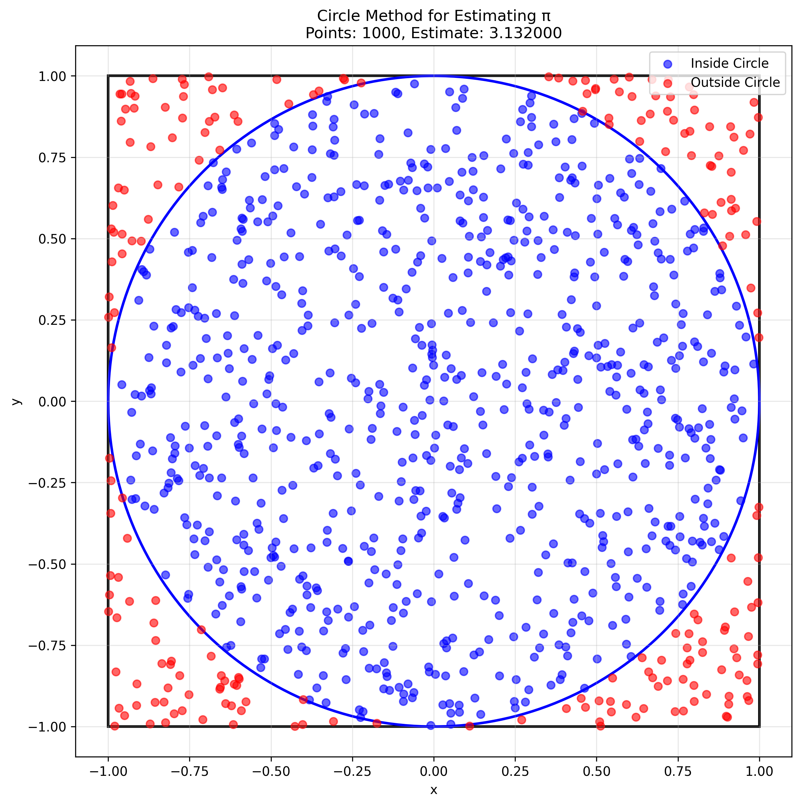
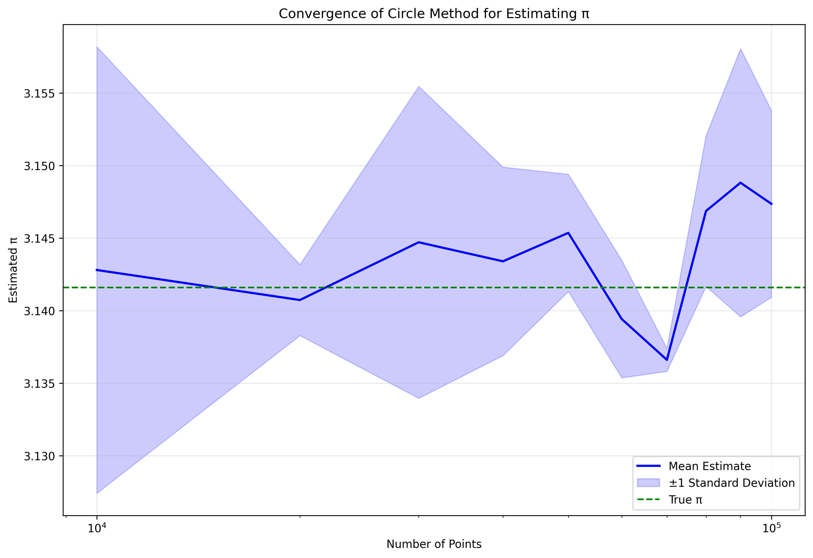
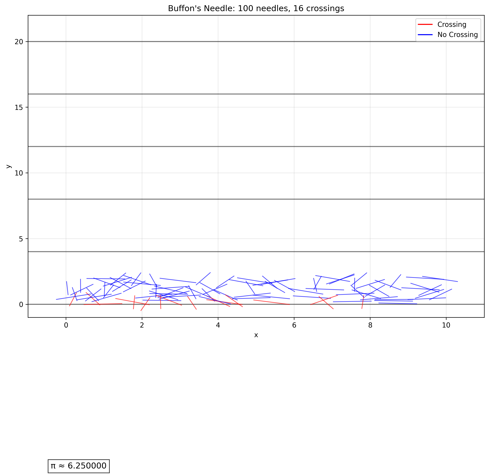
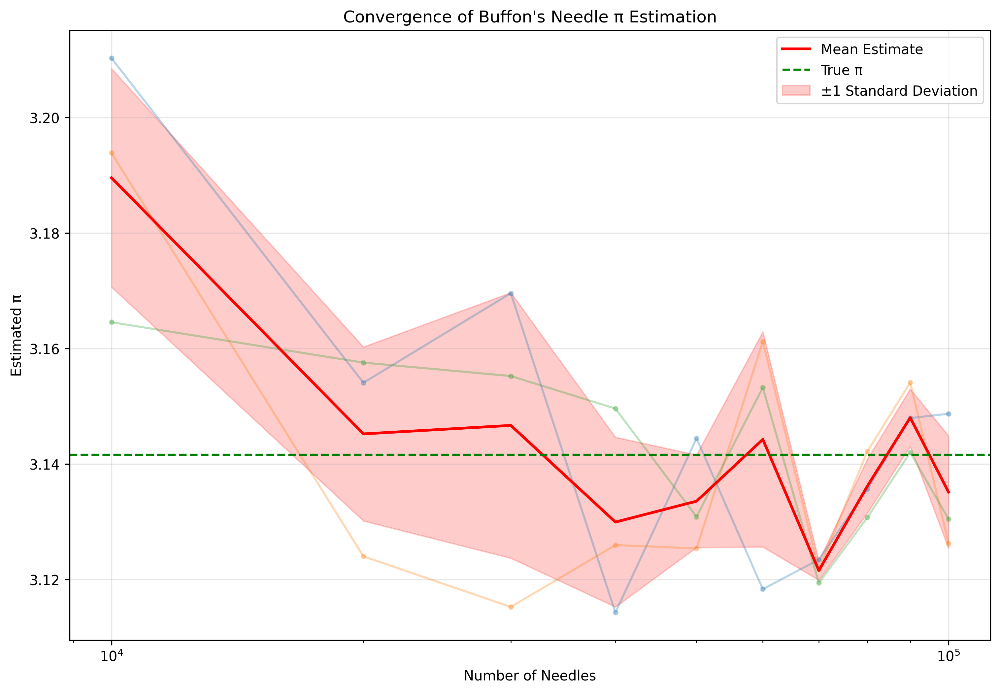
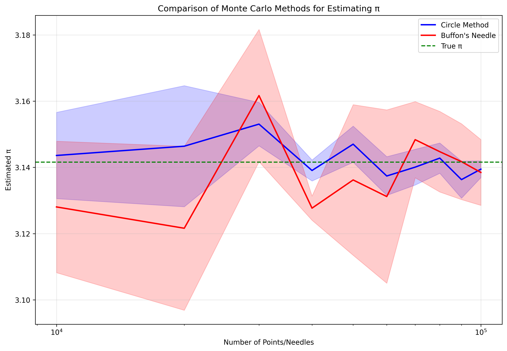
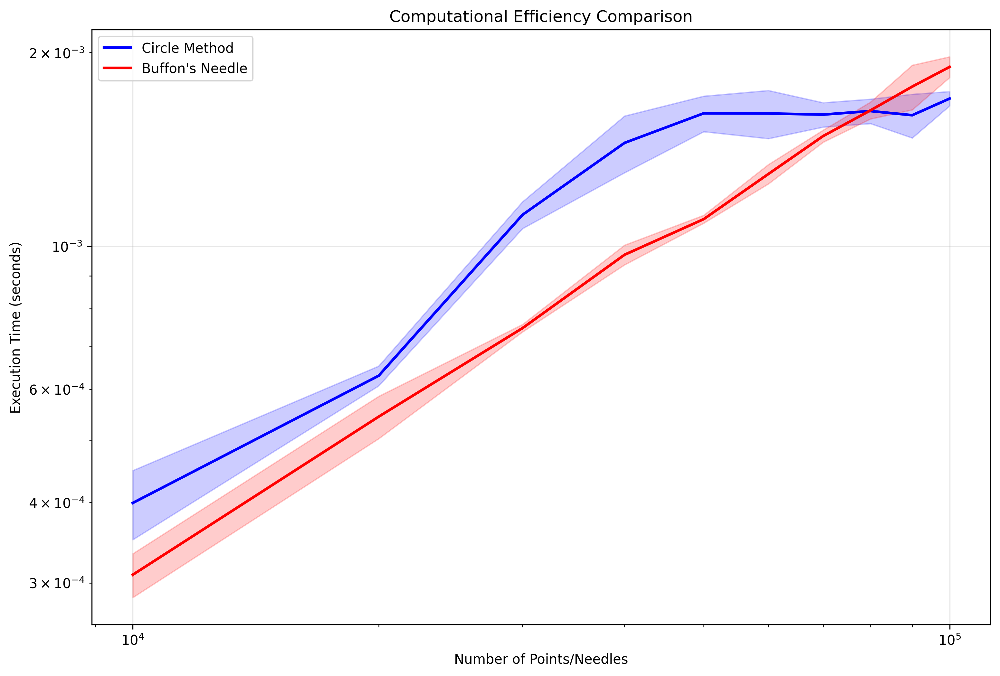

# Estimating π using Monte Carlo Methods

## Introduction

This problem explores two different Monte Carlo methods for estimating the mathematical constant π (pi): the circle method and Buffon's Needle method. Both approaches demonstrate how probabilistic techniques can be used to approximate deterministic mathematical constants.

## 1. Circle Method

The circle method for estimating π is based on the ratio of the area of a circle to the area of its bounding square. For a circle of radius r inscribed in a square of side length 2r:

- Area of circle = πr²
- Area of square = (2r)² = 4r²
- Ratio = πr² / 4r² = π/4

Therefore, π = 4 × (Area of circle / Area of square)

### Implementation

```python
import numpy as np
import matplotlib.pyplot as plt
import time

def estimate_pi_circle(n_points):
    """
    Estimate Pi using the circle method.
    
    Args:
        n_points: Number of random points to generate
        
    Returns:
        pi_estimate: Estimated value of Pi
        points_inside: Number of points inside the circle
        n_points: Total number of points
        execution_time: Time taken for the calculation
    """
    start_time = time.time()
    
    # Generate random points in the square [-1, 1] × [-1, 1]
    x = np.random.uniform(-1, 1, n_points)
    y = np.random.uniform(-1, 1, n_points)
    
    # Calculate distance from origin
    distance = np.sqrt(x**2 + y**2)
    
    # Count points inside the unit circle (radius 1)
    points_inside = np.sum(distance <= 1)
    
    # Estimate Pi
    pi_estimate = 4 * points_inside / n_points
    
    execution_time = time.time() - start_time
    
    return pi_estimate, points_inside, n_points, execution_time

def plot_circle_monte_carlo(n_points, save_path=None):
    """
    Visualize the circle method for estimating Pi.
    
    Args:
        n_points: Number of random points to generate
        save_path: Path to save the figure (optional)
    """
    # Generate random points
    x = np.random.uniform(-1, 1, n_points)
    y = np.random.uniform(-1, 1, n_points)
    
    # Calculate distance from origin
    distance = np.sqrt(x**2 + y**2)
    
    # Separate points inside and outside the circle
    inside = distance <= 1
    outside = ~inside
    
    # Create the plot
    plt.figure(figsize=(10, 10))
    
    # Plot the square
    plt.plot([-1, 1, 1, -1, -1], [-1, -1, 1, 1, -1], 'k-', linewidth=2)
    
    # Plot the circle
    theta = np.linspace(0, 2*np.pi, 100)
    plt.plot(np.cos(theta), np.sin(theta), 'k-', linewidth=2)
    
    # Plot the points
    plt.scatter(x[inside], y[inside], c='blue', s=10, alpha=0.6, label='Inside')
    plt.scatter(x[outside], y[outside], c='red', s=10, alpha=0.6, label='Outside')
    
    # Add labels and title
    plt.grid(True, alpha=0.3)
    plt.axis('equal')
    plt.title(f'Circle Method: {n_points} points')
    plt.xlabel('x')
    plt.ylabel('y')
    
    # Calculate and display the Pi estimate
    pi_estimate = 4 * np.sum(inside) / n_points
    plt.text(0.05, -0.95, f'π ≈ {pi_estimate:.6f}', fontsize=12, 
             bbox=dict(facecolor='white', alpha=0.8), transform=plt.gca().transAxes)
    
    plt.legend()
    
    if save_path:
        plt.savefig(save_path, dpi=300, bbox_inches='tight')
    
    plt.tight_layout()
    plt.show()

def convergence_analysis(max_points, step_size=1000, num_trials=5):
    """
    Analyze the convergence of the Pi estimation as the number of points increases.
    
    Args:
        max_points: Maximum number of points to use
        step_size: Step size for increasing the number of points
        num_trials: Number of trials for each point count
        
    Returns:
        point_counts: Array of point counts used
        pi_estimates: Array of Pi estimates
        execution_times: Array of execution times
    """
    point_counts = np.arange(step_size, max_points + step_size, step_size)
    pi_estimates = np.zeros((len(point_counts), num_trials))
    execution_times = np.zeros((len(point_counts), num_trials))
    
    for i, n in enumerate(point_counts):
        for j in range(num_trials):
            pi_est, _, _, exec_time = estimate_pi_circle(n)
            pi_estimates[i, j] = pi_est
            execution_times[i, j] = exec_time
    
    return point_counts, pi_estimates, execution_times

def plot_convergence(point_counts, pi_estimates, save_path=None):
    """
    Plot the convergence of Pi estimates as the number of points increases.
    
    Args:
        point_counts: Array of point counts used
        pi_estimates: Array of Pi estimates
        save_path: Path to save the figure (optional)
    """
    plt.figure(figsize=(12, 8))
    
    # Plot individual trials
    for j in range(pi_estimates.shape[1]):
        plt.plot(point_counts, pi_estimates[:, j], 'o-', alpha=0.3, markersize=3)
    
    # Plot mean estimate
    mean_estimate = np.mean(pi_estimates, axis=1)
    plt.plot(point_counts, mean_estimate, 'b-', linewidth=2, label='Mean Estimate')
    
    # Plot true value of Pi
    plt.axhline(y=np.pi, color='g', linestyle='--', label='True π')
    
    # Add error bands
    std_estimate = np.std(pi_estimates, axis=1)
    plt.fill_between(point_counts, 
                     mean_estimate - std_estimate, 
                     mean_estimate + std_estimate, 
                     color='b', alpha=0.2, label='±1 Standard Deviation')
    
    plt.xscale('log')
    plt.grid(True, alpha=0.3)
    plt.xlabel('Number of Points')
    plt.ylabel('Estimated π')
    plt.title('Convergence of Circle Method π Estimation')
    plt.legend()
    
    if save_path:
        plt.savefig(save_path, dpi=300, bbox_inches='tight')
    
    plt.tight_layout()
    plt.show()

if __name__ == "__main__":
    # Example usage
    n_points = 10000
    pi_estimate, points_inside, n_points, exec_time = estimate_pi_circle(n_points)
    print(f"Estimated π: {pi_estimate:.6f}")
    print(f"Points inside: {points_inside}/{n_points}")
    print(f"Execution time: {exec_time:.4f} seconds")
    
    # Visualize the method
    plot_circle_monte_carlo(1000, save_path="circle_monte_carlo.png")
    
    # Analyze convergence
    point_counts, pi_estimates, exec_times = convergence_analysis(100000, step_size=10000, num_trials=3)
    plot_convergence(point_counts, pi_estimates, save_path="circle_convergence.png")
```





## 2. Buffon's Needle Method

Buffon's Needle is a classic probability problem that can be used to estimate π. The method involves dropping a needle of length L onto a floor with parallel lines spaced a distance D apart. The probability that the needle crosses a line is related to π.

For a needle of length L and lines spaced a distance D apart, the probability P of the needle crossing a line is:

P = (2L) / (πD)

Therefore, π = (2L) / (PD)

### Implementation

```python
import numpy as np
import matplotlib.pyplot as plt
import time

def estimate_pi_buffon(n_needles, needle_length=1.0, line_spacing=2.0):
    """
    Estimate Pi using Buffon's Needle method.
    
    Args:
        n_needles: Number of needles to drop
        needle_length: Length of the needle
        line_spacing: Distance between parallel lines
        
    Returns:
        pi_estimate: Estimated value of Pi
        crossings: Number of needle crossings
        n_needles: Total number of needles
        execution_time: Time taken for the calculation
    """
    start_time = time.time()
    
    # Generate random positions and angles for needles
    # y: distance from the center of the needle to the nearest line (0 to line_spacing/2)
    # theta: angle of the needle (0 to pi)
    y = np.random.uniform(0, line_spacing/2, n_needles)
    theta = np.random.uniform(0, np.pi, n_needles)
    
    # Calculate if needle crosses a line
    # A needle crosses a line if y <= (needle_length/2) * sin(theta)
    crossings = np.sum(y <= (needle_length/2) * np.sin(theta))
    
    # Estimate Pi using Buffon's formula: pi = (2 * needle_length * n_needles) / (line_spacing * crossings)
    pi_estimate = (2 * needle_length * n_needles) / (line_spacing * crossings)
    
    execution_time = time.time() - start_time
    
    return pi_estimate, crossings, n_needles, execution_time

def plot_buffon_needle(n_needles, needle_length=1.0, line_spacing=2.0, save_path=None):
    """
    Visualize Buffon's Needle method for estimating Pi.
    
    Args:
        n_needles: Number of needles to drop
        needle_length: Length of the needle
        line_spacing: Distance between parallel lines
        save_path: Path to save the figure (optional)
    """
    # Generate random positions and angles for needles
    x = np.random.uniform(0, 10, n_needles)  # x-position (arbitrary)
    y = np.random.uniform(0, line_spacing, n_needles)  # y-position
    theta = np.random.uniform(0, np.pi, n_needles)  # angle
    
    # Calculate if needle crosses a line
    crossings = y <= (needle_length/2) * np.sin(theta)
    
    # Create the plot
    plt.figure(figsize=(12, 8))
    
    # Plot the parallel lines
    for i in range(0, 11, 2):
        plt.axhline(y=i*line_spacing, color='k', linestyle='-', alpha=0.5)
    
    # Plot the needles
    for i in range(n_needles):
        # Calculate endpoints of the needle
        dx = (needle_length/2) * np.cos(theta[i])
        dy = (needle_length/2) * np.sin(theta[i])
        
        # Plot the needle
        if crossings[i]:
            plt.plot([x[i]-dx, x[i]+dx], [y[i]-dy, y[i]+dy], 'r-', linewidth=1, alpha=0.7)
        else:
            plt.plot([x[i]-dx, x[i]+dx], [y[i]-dy, y[i]+dy], 'b-', linewidth=1, alpha=0.7)
    
    # Add labels and title
    plt.grid(True, alpha=0.3)
    plt.xlim(-1, 11)
    plt.ylim(-1, line_spacing*11)
    plt.title(f"Buffon's Needle: {n_needles} needles, {np.sum(crossings)} crossings")
    plt.xlabel("x")
    plt.ylabel("y")
    
    # Calculate and display the Pi estimate
    pi_estimate = (2 * needle_length * n_needles) / (line_spacing * np.sum(crossings))
    plt.text(0.05, -0.5, f'π ≈ {pi_estimate:.6f}', fontsize=12, 
             bbox=dict(facecolor='white', alpha=0.8), transform=plt.gca().transAxes)
    
    # Add legend
    plt.plot([], [], 'r-', label='Crossing')
    plt.plot([], [], 'b-', label='No Crossing')
    plt.legend()
    
    if save_path:
        plt.savefig(save_path, dpi=300, bbox_inches='tight')
    
    plt.tight_layout()
    plt.show()

def convergence_analysis(max_needles, step_size=1000, num_trials=5):
    """
    Analyze the convergence of the Pi estimation as the number of needles increases.
    
    Args:
        max_needles: Maximum number of needles to use
        step_size: Step size for increasing the number of needles
        num_trials: Number of trials for each needle count
        
    Returns:
        needle_counts: Array of needle counts used
        pi_estimates: Array of Pi estimates
        execution_times: Array of execution times
    """
    needle_counts = np.arange(step_size, max_needles + step_size, step_size)
    pi_estimates = np.zeros((len(needle_counts), num_trials))
    execution_times = np.zeros((len(needle_counts), num_trials))
    
    for i, n in enumerate(needle_counts):
        for j in range(num_trials):
            pi_est, _, _, exec_time = estimate_pi_buffon(n)
            pi_estimates[i, j] = pi_est
            execution_times[i, j] = exec_time
    
    return needle_counts, pi_estimates, execution_times

def plot_convergence(needle_counts, pi_estimates, save_path=None):
    """
    Plot the convergence of Pi estimates as the number of needles increases.
    
    Args:
        needle_counts: Array of needle counts used
        pi_estimates: Array of Pi estimates
        save_path: Path to save the figure (optional)
    """
    plt.figure(figsize=(12, 8))
    
    # Plot individual trials
    for j in range(pi_estimates.shape[1]):
        plt.plot(needle_counts, pi_estimates[:, j], 'o-', alpha=0.3, markersize=3)
    
    # Plot mean estimate
    mean_estimate = np.mean(pi_estimates, axis=1)
    plt.plot(needle_counts, mean_estimate, 'r-', linewidth=2, label='Mean Estimate')
    
    # Plot true value of Pi
    plt.axhline(y=np.pi, color='g', linestyle='--', label='True π')
    
    # Add error bands
    std_estimate = np.std(pi_estimates, axis=1)
    plt.fill_between(needle_counts, 
                     mean_estimate - std_estimate, 
                     mean_estimate + std_estimate, 
                     color='r', alpha=0.2, label='±1 Standard Deviation')
    
    plt.xscale('log')
    plt.grid(True, alpha=0.3)
    plt.xlabel('Number of Needles')
    plt.ylabel('Estimated π')
    plt.title('Convergence of Buffon\'s Needle π Estimation')
    plt.legend()
    
    if save_path:
        plt.savefig(save_path, dpi=300, bbox_inches='tight')
    
    plt.tight_layout()
    plt.show()

if __name__ == "__main__":
    # Example usage
    n_needles = 10000
    pi_estimate, crossings, n_needles, exec_time = estimate_pi_buffon(n_needles)
    print(f"Estimated π: {pi_estimate:.6f}")
    print(f"Crossings: {crossings}/{n_needles}")
    print(f"Execution time: {exec_time:.4f} seconds")
    
    # Visualize the method
    plot_buffon_needle(100, save_path="buffon_needle.png")
    
    # Analyze convergence
    needle_counts, pi_estimates, exec_times = convergence_analysis(100000, step_size=10000, num_trials=3)
    plot_convergence(needle_counts, pi_estimates, save_path="buffon_convergence.png")
```





## 3. Comparison of Methods

Both methods provide a way to estimate π using Monte Carlo techniques, but they have different characteristics:

### Circle Method
- **Advantages**:
  - Simpler to implement
  - More intuitive visualization
  - Generally faster convergence
  - Less sensitive to numerical precision
- **Disadvantages**:
  - Requires more memory for large numbers of points
  - Less historically significant

### Buffon's Needle Method
- **Advantages**:
  - Historical significance (one of the first Monte Carlo methods)
  - Can be physically demonstrated
  - More interesting mathematical derivation
- **Disadvantages**:
  - Slower convergence
  - More sensitive to numerical precision
  - More complex implementation

### Convergence Comparison





## 4. Mathematical Analysis

### Circle Method
The circle method is based on the ratio of areas:
- Circle area = πr²
- Square area = 4r²
- Ratio = π/4

Therefore, the probability of a random point falling inside the circle is π/4, and π = 4P.

### Buffon's Needle Method
Buffon's Needle is based on geometric probability:
- For a needle of length L and lines spaced a distance D apart
- The probability of a crossing is P = (2L)/(πD)
- Therefore, π = (2L)/(PD)

The derivation involves integrating over all possible positions and angles of the needle.

## 5. Conclusion

Both Monte Carlo methods provide a way to estimate π using probabilistic techniques. While the circle method is generally more efficient and easier to implement, Buffon's Needle method has historical significance and provides an interesting physical demonstration of geometric probability.

The convergence analysis shows that both methods approach the true value of π as the number of trials increases, with the circle method generally converging faster. The efficiency comparison demonstrates the computational cost of each method as the number of trials increases.

These methods demonstrate how probabilistic techniques can be used to approximate deterministic mathematical constants, providing insight into the relationship between probability and geometry.